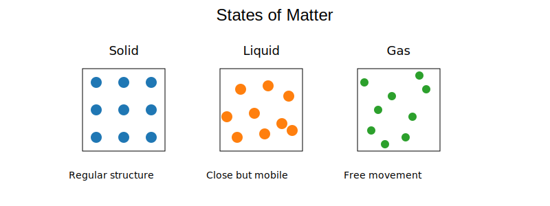
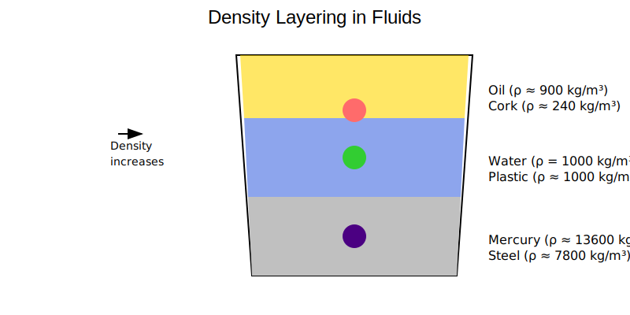
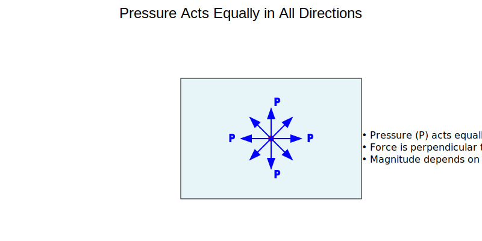
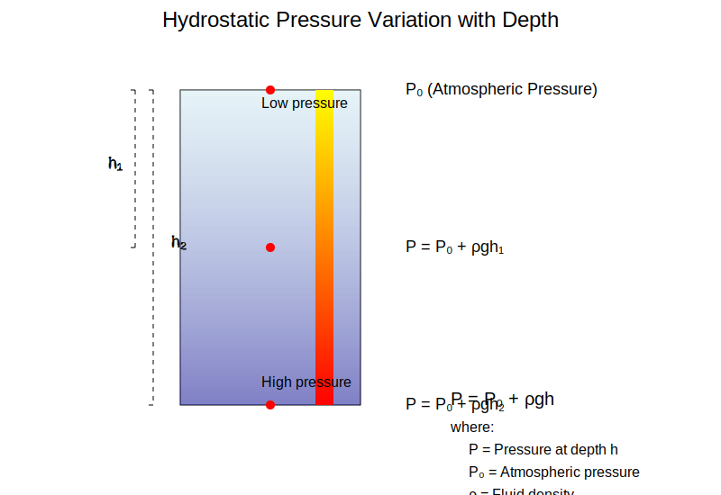
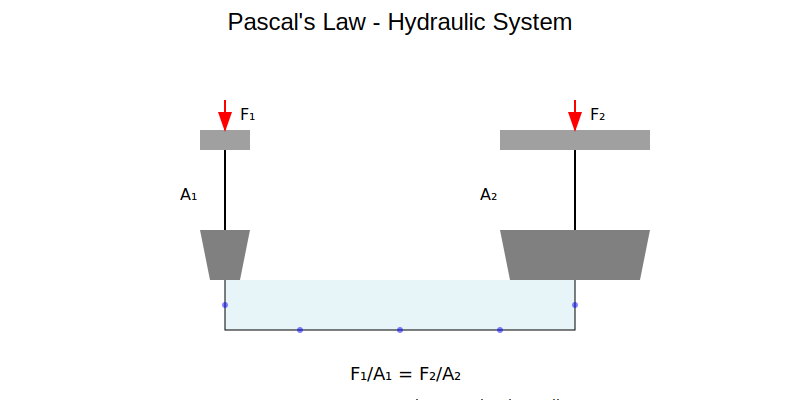
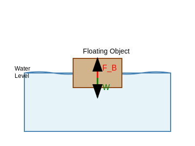
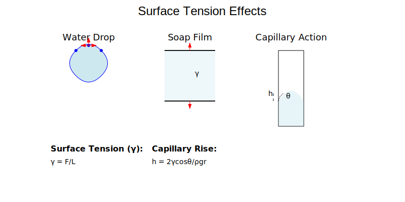
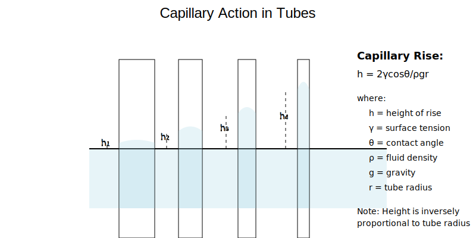
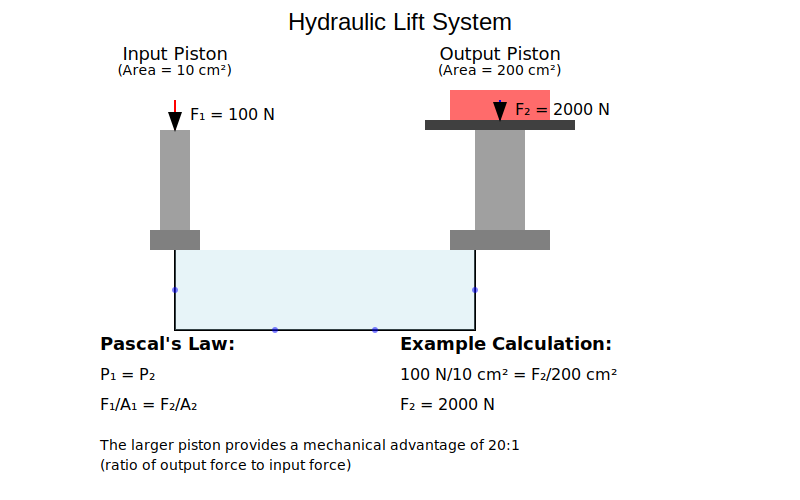

### Introduction to Fluid Statics
[Click here to view  Animation on Fluid Statics ↗️](https://all-animations-x.vercel.app/fluid-statics)

 Fluid Statics is a fundamental branch of fluid mechanics that deals with fluids at rest. Today, we'll explore the principles that govern fluid behavior under static conditions and their practical applications in engineering and natural phenomena.

*Figure 1: Different states of matter showing molecular arrangement in solids, liquids, and gases*

### Introduction to Fluids

A fluid is a substance that can flow and deform continuously under applied stress. Both liquids and gases are classified as fluids. The key distinction from solids lies in their inability to maintain a fixed shape. Fluids conform to the shape of their container while maintaining a constant volume (for liquids) or expanding to fill the available volume (for gases).

### Density and Specific Gravity

Density is one of the most fundamental properties of matter that plays a crucial role in fluid mechanics. Represented by the Greek letter $\rho$ (rho), density describes how much mass is packed into a given volume of a substance. Mathematically, we express density as:

$$ \rho = \frac{m}{V} $$

This elegant relationship tells us that density is simply the mass of a substance divided by the volume it occupies. In the International System of Units (SI), we measure density in kilograms per cubic meter (kg/m³). This means that a substance with a density of 1000 kg/m³ has 1000 kilograms of mass packed into every cubic meter of volume.

Understanding density helps us explain many everyday phenomena. For instance, when you see oil floating on water, it's because oil has a lower density (approximately 920 kg/m³) than water (1000 kg/m³). The same principle explains why hot air balloons rise – heated air is less dense than the cooler air surrounding it.

Closely related to density is the concept of specific gravity (SG), a dimensionless quantity that compares the density of a substance to that of water at 4°C (where water has its maximum density of 1000 kg/m³). We express specific gravity as:

$$ SG = \frac{\rho_{\text{substance}}}{\rho_{\text{water}}} $$

Specific gravity provides us with an intuitive way to understand relative densities. A substance with a specific gravity greater than 1 will sink in water, while one with a specific gravity less than 1 will float. For example, mercury has a specific gravity of 13.6, which means it's 13.6 times denser than water. This explains why mercury forms a dense, silvery pool at the bottom of a container when mixed with water.

The temperature dependence of density is also significant in nature. Water exhibits an unusual property – it reaches its maximum density at 4°C. This peculiar characteristic has profound implications for aquatic life, as it causes lakes to freeze from the top down, allowing fish to survive in the warmer water below the ice layer.

In engineering applications, understanding density and specific gravity is crucial for:
- Designing floating vessels, where the average density must be less than that of water
- Separating materials in mining and recycling through density-based separation
- Calculating hydrostatic pressures in dams and underwater structures
- Determining buoyant forces in submarine design

*Figure 2: Density comparison showing different materials floating in layers based on their densities*

### Pressure in Fluids

Pressure is a fundamental concept in fluid mechanics that describes how forces are transmitted through fluids. At its core, pressure represents the force applied perpendicular to a surface per unit area. This relationship is expressed mathematically as:

$$ P = \frac{F}{A} $$

where $F$ is the force acting perpendicular to the surface and $A$ is the area over which the force is distributed. In the SI system, pressure is measured in Pascals (Pa), where 1 Pascal equals one Newton per square meter (1 Pa = 1 N/m²). To put this in perspective, the atmospheric pressure at sea level is approximately 101,325 Pa, or about 101.3 kPa.

One of the most remarkable properties of fluids is how they handle pressure. Unlike solids, which can support both shear stresses and normal stresses, fluids at rest can only support forces perpendicular to any surface. This leads to several fascinating properties of fluid pressure:

1. Pressure acts equally in all directions at a point in a fluid. This means that if you were to place a tiny pressure sensor in a fluid and rotate it, it would measure the same pressure regardless of its orientation. This property explains why we don't need to worry about which way we orient underwater equipment – it experiences the same pressure from all directions.

2. Pressure at any point in a static fluid depends only on the vertical depth from the surface, not on the shape of the container. This phenomenon, known as the hydrostatic paradox, explains why connected containers of different shapes but the same height will have the same pressure at their bases.

When discussing pressure in fluids, we encounter three important types that help us understand different practical situations:

**Absolute Pressure** represents the total pressure at a point, including all contributions. It's measured relative to a perfect vacuum and is always positive. In mathematical terms:

$$ P_{\text{absolute}} = P_{\text{gauge}} + P_{\text{atmospheric}} $$

**Gauge Pressure** is what most pressure measuring devices actually display. It's the pressure relative to atmospheric pressure, and it can be either positive or negative. When you check your car's tire pressure, you're measuring gauge pressure.

**Atmospheric Pressure** is the pressure exerted by the weight of the air column above us. It varies with altitude and weather conditions, but at sea level, it's approximately 101.3 kPa. This pressure is so much a part of our daily lives that we rarely notice it, yet it's crucial for many natural processes, from drinking through a straw to weather patterns.

*Figure 3: Pressure acting equally in all directions within a fluid*

The effects of pressure in fluids manifest in numerous ways in our daily lives and in nature:

In the human body, blood pressure is carefully regulated to ensure proper circulation. When doctors measure your blood pressure, they're actually measuring two pressures: systolic (when the heart contracts) and diastolic (when the heart relaxes).

In engineering, understanding fluid pressure is crucial for:
- Designing underwater structures that must withstand enormous pressures at depth
- Creating hydraulic systems that use fluid pressure to multiply force
- Developing pressure vessels for industrial processes
- Building dams that must safely contain large volumes of water

The concept of pressure in fluids also explains many natural phenomena, such as:
- Why our ears "pop" when changing altitude rapidly
- How fish control their depth using swim bladders
- Why deep-sea creatures have evolved to withstand enormous pressures
- How trees transport water from their roots to their highest leaves

Understanding pressure in fluids provides the foundation for many advanced concepts in fluid mechanics, including Pascal's Law and hydrostatic pressure, which we'll explore in more detail in the following sections.

### Hydrostatic Pressure

Hydrostatic pressure is a fundamental concept that explains how pressure varies with depth in a static fluid. Anyone who has dived to the bottom of a swimming pool has experienced this pressure as a sensation in their ears. This phenomenon arises from the weight of the fluid column above any point in the fluid.

The mathematical relationship describing hydrostatic pressure is elegantly simple yet profound:

$$ P = P_0 + \rho gh $$

This equation, often called the hydrostatic pressure equation, tells us a complete story about pressure variation in fluids. Let's understand each term:

- $P_0$ represents the pressure at the reference level, typically the atmospheric pressure at the fluid's surface (101.3 kPa at sea level)
- $\rho$ (rho) is the fluid's density, which remains constant for incompressible fluids like water (1000 kg/m³)
- $g$ is the acceleration due to gravity (9.81 m/s²), which pulls the fluid downward
- $h$ is the vertical depth below the reference level, measured in meters

*Figure 4: Variation of pressure with depth in a fluid column*

The beauty of this equation lies in its implications and applications. Consider these fascinating properties:

**Linear Depth Relationship**: The pressure increases linearly with depth. For every 10 meters of depth in water, the pressure increases by approximately 1 atmosphere (101.3 kPa). This linear relationship makes it easy for divers to calculate pressures at different depths. At 30 meters underwater, for example, a diver experiences four atmospheres of pressure – one from the air above and three from the water.

**Directional Independence**: At any point in the fluid, the pressure acts equally in all directions. This remarkable property means that a submarine's hull experiences the same pressure on all sides, requiring uniform strength in its design. The pressure doesn't "know" which way is up or down; it simply acts perpendicular to any surface it encounters.

**The Pascal's Paradox**: Perhaps the most counterintuitive property is that hydrostatic pressure depends only on the depth and fluid density, not on the shape or amount of fluid. This means that a tall, narrow tube of water can exert the same bottom pressure as a wide lake of the same depth. This principle, known as Pascal's paradox, has important implications for dam design and fluid storage.

The implications of hydrostatic pressure in real-world applications are vast:

In Marine Biology:
- Deep-sea creatures have evolved remarkable adaptations to withstand enormous pressures. At the bottom of the Mariana Trench (11 km deep), the pressure exceeds 1,000 atmospheres!
- Fish have developed swim bladders that help them maintain equilibrium at different depths by adjusting their buoyancy.

In Engineering:
- Dam designers must account for the increasing pressure with depth when determining wall thickness and reinforcement.
- Submarine designers use pressure hulls with cylindrical and spherical shapes to distribute hydrostatic forces evenly.
- Hydraulic systems in machinery utilize the transmission of hydrostatic pressure for mechanical advantage.

In Everyday Life:
- The pressure in your home's water system depends on the height of the water tower serving your area.
- When you drink through a straw, you're actually utilizing atmospheric pressure by creating a pressure difference.
- The design of swimming pools and aquariums must account for pressure variation with depth.

A practical example helps illustrate these concepts: Consider a typical swimming pool 2 meters deep. At the bottom, the hydrostatic pressure is:

$$ P = 101,300 + (1000)(9.81)(2) = 120,920 \text{ Pa} $$

This means the pressure at the bottom is about 20% higher than at the surface, explaining why your ears feel pressure when diving to the pool's bottom.

Understanding hydrostatic pressure is crucial for many applications, from designing underwater structures to explaining natural phenomena. It forms the foundation for more advanced concepts in fluid dynamics and helps us appreciate the remarkable properties of fluids in our world.

### Pascal's Law

Pascal's Law states that pressure applied to an enclosed fluid is transmitted undiminished throughout the fluid and acts perpendicular to every surface. This principle forms the basis for hydraulic systems and can be expressed mathematically as:

$$ \frac{F_1}{A_1} = \frac{F_2}{A_2} $$

*Figure 5: Pascal's Law demonstrated in a hydraulic system*

This equation shows how force can be amplified in hydraulic systems, leading to applications in hydraulic lifts, brakes, and industrial machinery.

### Buoyancy and Archimedes' Principle

Have you ever wondered why massive steel ships float while a small metal coin sinks? The answer lies in one of the most elegant principles in fluid mechanics: Archimedes' Principle. Legend has it that Archimedes discovered this principle while taking a bath, leading to his famous "Eureka!" moment.

Archimedes' Principle states that any object immersed in a fluid experiences an upward buoyant force equal to the weight of the fluid displaced by that object. This fundamental principle is expressed mathematically as:

$$ F_B = \rho_{\text{fluid}} V_{\text{displaced}} g $$

where:
- $F_B$ is the buoyant force
- $\rho_{\text{fluid}}$ is the density of the fluid
- $V_{\text{displaced}}$ is the volume of fluid displaced by the object
- $g$ is the acceleration due to gravity ($9.81 \text{ m/s}^2$)

 

*Figure 6: Buoyancy force and weight acting on a floating object*

 

The interaction between this buoyant force and an object's weight leads to three fascinating scenarios:

**1. When Objects Float ($\rho_{\text{object}} < \rho_{\text{fluid}}$)**
In this case, the buoyant force exceeds the object's weight, causing it to float partially submerged. The object will sink until it displaces exactly enough fluid to balance its weight. This explains why:
- A wooden block floats with part of it above water (wood density ≈ 700 kg/m³)
- Ice floats in water with about 10% above the surface (ice density = 917 kg/m³)
- Massive ships float despite being made of steel, thanks to their hollow design that reduces their average density

**2. When Objects are Neutrally Buoyant ($\rho_{\text{object}} = \rho_{\text{fluid}}$)**
Here, the buoyant force exactly equals the object's weight, causing it to remain suspended at any depth. This principle is utilized by:
- Fish, which adjust their swim bladders to achieve neutral buoyancy at different depths
- Submarines, which control their buoyancy by adjusting ballast tanks
- SCUBA divers, who fine-tune their buoyancy with buoyancy compensator devices (BCDs)

**3. When Objects Sink ($\rho_{\text{object}} > \rho_{\text{fluid}}$)**
In this scenario, the object's weight exceeds the buoyant force, causing it to sink. Examples include:
- A metal anchor dropping to the ocean floor
- Sediment settling at the bottom of a lake
- Dense minerals sinking during ore separation processes

For floating objects, we can write a balance equation:

$$ \rho_{\text{object}} V_{\text{object}} g = \rho_{\text{fluid}} V_{\text{displaced}} g $$

This equation reveals that the fraction of an object submerged equals the ratio of its density to the fluid's density. For example, if an iceberg's density is 917 kg/m³, then 917/1000 = 91.7% of its volume will be submerged in seawater.

The applications of Archimedes' Principle are vast and fascinating:

In Nature:
- Hot air balloons float because heated air is less dense than the surrounding cool air
- Fish use swim bladders to maintain neutral buoyancy at different depths
- Water striders walk on water by utilizing surface tension and buoyancy
- Icebergs float with approximately 90% of their volume underwater

In Engineering:
- Ship design relies on creating hulls that displace enough water to support the vessel's weight
- Hydrometers use buoyancy to measure fluid density in applications from battery testing to wine making
- Submarine designers calculate precise ballast requirements for different operating depths
- Oil spill containment booms float on water to contain environmental hazards

In Daily Life:
- Life jackets are designed to provide enough buoyant force to keep a person afloat
- Pool toys and inflatable devices use air-filled chambers to reduce their average density
- Fishing bobbers use buoyancy to indicate when a fish takes the bait
- Density separation in recycling facilities sorts different plastics based on buoyancy

A practical example illustrates these principles: Consider a 1000 kg boat. To float, it must displace 1000 kg of water. Since water's density is 1000 kg/m³, the boat must displace exactly 1 cubic meter of water to float. This displacement can be achieved through proper hull design, regardless of the boat's total volume.

Understanding buoyancy and Archimedes' Principle is crucial not only for engineering applications but also for appreciating the delicate balance that allows marine life to thrive and enables human navigation of the world's waterways.

### Surface Tension and Capillarity

Surface tension ($\gamma$) arises from the cohesive forces between liquid molecules at the surface. It is defined as the force per unit length acting along the surface:

$$ \gamma = \frac{F}{L} $$

*Figure 7: Surface tension effects showing molecular forces and resulting phenomena*

Surface tension leads to several phenomena:

1. Formation of liquid drops
2. Capillary action, described by the equation:
   $$ h = \frac{2\gamma \cos\theta}{\rho g r} $$
   where $h$ is the height of liquid rise, $\theta$ is the contact angle, and $r$ is the tube radius

*Figure 8: Capillary action in tubes of different diameters*

### Practice Questions

1. **Hydrostatic Pressure**
   
   Q1: A submarine is submerged to a depth of 100 meters in seawater (density = 1025 kg/m³). Calculate the hydrostatic pressure at this depth. (Take g = 9.81 m/s²)
   
   A1: Using P = ρgh
   * P = 1025 kg/m³ × 9.81 m/s² × 100 m
   * P = 1,005,525 Pa or approximately 1.01 MPa
   * This is about 10 atmospheres of pressure!

   Q2: A dam wall holds back water to a height of 25 meters. Calculate the pressure difference between the top and bottom of the dam. (Water density = 1000 kg/m³)
   
   A2: Using ΔP = ρgh
   * ΔP = 1000 kg/m³ × 9.81 m/s² × 25 m
   * ΔP = 245,250 Pa or 0.245 MPa

   Q3: In a manometer filled with mercury (density = 13,600 kg/m³), the height difference between the two columns is 15 cm. What is the pressure difference in Pascal?
   
   A3: Using ΔP = ρgh
   * ΔP = 13,600 kg/m³ × 9.81 m/s² × 0.15 m
   * ΔP = 20,006.4 Pa or about 20 kPa

2. **Buoyancy**
   
   Q1: A cube of wood with sides 10 cm floats in water with 8 cm submerged. What is the density of the wood? (Water density = 1000 kg/m³)
   
   A1: Using the principle that the fraction submerged equals the ratio of densities:
   * Fraction submerged = 8/10 = 0.8
   * ρ_wood/ρ_water = 0.8
   * ρ_wood = 0.8 × 1000 kg/m³
   * ρ_wood = 800 kg/m³

   Q2: An iceberg floats in seawater (density = 1025 kg/m³). If the density of ice is 920 kg/m³, what fraction of the iceberg's volume is above water?
   
   A2: Using the ratio of densities:
   * Fraction submerged = ρ_ice/ρ_seawater = 920/1025 = 0.898
   * Fraction above water = 1 - 0.898 = 0.102 or 10.2%

   Q3: A hollow aluminum sphere (density = 2700 kg/m³) has an outer radius of 10 cm and inner radius of 9 cm. Will it float or sink in water?
   
   A3: Let's solve step by step:
   * Volume of aluminum = 4/3π(R₁³ - R₂³) = 4/3π(0.1³ - 0.09³) = 0.00127 m³
   * Mass of aluminum = 2700 kg/m³ × 0.00127 m³ = 3.429 kg
   * Total volume = 4/3π(0.1)³ = 0.00419 m³
   * Buoyant force = 1000 kg/m³ × 9.81 m/s² × 0.00419 m³ = 41.1 N
   * Weight = 3.429 kg × 9.81 m/s² = 33.6 N
   * Since buoyant force > weight, it will float!

3. **Pascal's Law**
   
   Q1: In a hydraulic lift, the input piston has a diameter of 5 cm and the output piston has a diameter of 25 cm. If a force of 100 N is applied to the input piston, what force will be produced at the output piston?
   
   A1: Using Pascal's Law (F₁/A₁ = F₂/A₂):
   * A₁ = π(0.025 m)² = 0.00196 m²
   * A₂ = π(0.125 m)² = 0.0491 m²
   * F₂ = (F₁ × A₂)/A₁
   * F₂ = (100 N × 0.0491)/(0.00196)
   * F₂ = 2500 N

   Q2: A hydraulic brake system has an input piston of diameter 2 cm and four output pistons each of diameter 5 cm. What force is applied to each wheel if the brake pedal is pushed with 200 N?
   
   A2: Using Pascal's Law:
   * A₁ = π(0.01)² = 0.000314 m²
   * A₂ = π(0.025)² = 0.00196 m²
   * Pressure = F₁/A₁ = 200/0.000314 = 636,943 Pa
   * Force per wheel = Pressure × A₂ = 636,943 × 0.00196 = 1,248 N

   Q3: In a hydraulic press, a 500 N force on the input piston creates a 15 kN force on the output piston. If the input piston has a diameter of 3 cm, what is the diameter of the output piston?
   
   A3: Using Pascal's Law:
   * A₁ = π(0.015)² = 0.000707 m²
   * F₁/A₁ = F₂/A₂
   * A₂ = (F₂ × A₁)/F₁ = (15000 × 0.000707)/500 = 0.0212 m²
   * πr² = 0.0212
   * r = √(0.0212/π) = 0.082 m
   * Diameter = 0.164 m or 16.4 cm

4. **Surface Tension**
   
   Q1: Water rises in a glass capillary tube to a height of 3.0 cm. If the tube's inner radius is 0.15 mm and water's surface tension is 0.073 N/m, what is the contact angle between water and glass? (Water density = 1000 kg/m³, g = 9.81 m/s²)
   
   A1: Using h = (2γ cos θ)/(ρgr):
   * 0.03 = (2 × 0.073 × cos θ)/(1000 × 9.81 × 0.00015)
   * Solving for θ:
   * cos θ = 0.92
   * θ ≈ 23°

   Q2: Calculate the surface tension of a liquid if it forms a soap film that can support a wire of mass 0.5 g and length 4 cm. The film has two surfaces.
   
   A2: Using F = 2Lγ (factor of 2 because of two surfaces):
   * Weight = mg = 0.0005 kg × 9.81 m/s² = 0.004905 N
   * 0.004905 = 2 × 0.04 m × γ
   * γ = 0.004905/(2 × 0.04) = 0.061 N/m

   Q3: A needle of length 3 cm and mass 0.3 g floats on water. What is the depression depth of the water surface? (Surface tension of water = 0.073 N/m)
   
   A3: Using mg = 2Lγsin(θ):
   * mg = 0.0003 kg × 9.81 m/s² = 0.002943 N
   * 0.002943 = 2 × 0.03 m × 0.073 N/m × sin(θ)
   * sin(θ) = 0.67
   * θ = 42°
   * Depression depth = 0.073/(1000 × 9.81) × sin(42°) = 4.9 mm

5. **Archimedes' Principle**
   
   Q1: A 50 kg solid metal sphere is suspended in water by a rope. The sphere has a volume of 0.004 m³. What is the tension in the rope? (Water density = 1000 kg/m³, g = 9.81 m/s²)
   
   A1: Using F_B = ρVg:
   * Weight = mg = 50 kg × 9.81 m/s² = 490.5 N
   * Buoyant force = 1000 kg/m³ × 0.004 m³ × 9.81 m/s² = 39.24 N
   * Tension = Weight - Buoyant force
   * Tension = 490.5 N - 39.24 N = 451.26 N

   Q2: A hot air balloon has a volume of 2800 m³. If the air inside the balloon has a density of 0.95 kg/m³ and the outside air density is 1.2 kg/m³, what mass can the balloon lift? (g = 9.81 m/s²)
   
   A2: Using Archimedes' principle:
   * Buoyant force = ρ_outside × V × g = 1.2 × 2800 × 9.81 = 32,961.6 N
   * Weight of contained air = ρ_inside × V × g = 0.95 × 2800 × 9.81 = 26,094.6 N
   * Net lifting force = 32,961.6 - 26,094.6 = 6,867 N
   * Maximum mass = 6,867/9.81 = 700 kg

   Q3: A crown weighs 7.84 N in air and 6.86 N when submerged in water. Is it made of pure gold (density = 19,300 kg/m³)?
   
   A3: Using Archimedes' principle:
   * Buoyant force = Weight in air - Weight in water = 7.84 N - 6.86 N = 0.98 N
   * Volume of crown = Buoyant force/(ρ_water × g) = 0.98/(1000 × 9.81) = 0.0001 m³
   * Mass of crown = Weight in air/g = 7.84/9.81 = 0.799 kg
   * Density of crown = Mass/Volume = 0.799/0.0001 = 7,990 kg/m³
   * Since this is much less than gold's density, the crown is not pure gold!

These problems demonstrate practical applications of fluid statics principles and show how to approach real-world calculations.

### Practical Example

Consider a hydraulic lift system used in an auto repair shop. If the input piston has an area of 10 cm² and the output piston has an area of 200 cm², calculate the output force when an input force of 100 N is applied.

*Figure 10: Schematic diagram of a hydraulic lift system*

Using Pascal's Law:
$$ \frac{100\text{ N}}{10\text{ cm}^2} = \frac{F_2}{200\text{ cm}^2} $$
$$ F_2 = 2000\text{ N} $$

This demonstrates the practical advantage of hydraulic systems in force multiplication.

### Summary

Fluid statics provides the foundation for understanding fluid behavior at rest. The principles we've covered today—pressure, Pascal's Law, and Archimedes' Principle—form the basis for numerous engineering applications and help explain many natural phenomena. In our next lecture, we'll build upon these concepts as we delve into fluid dynamics.

---
