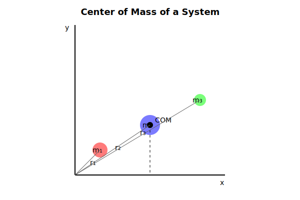
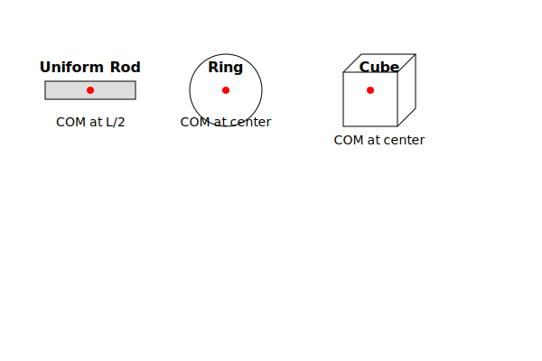
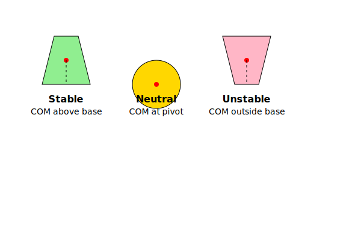
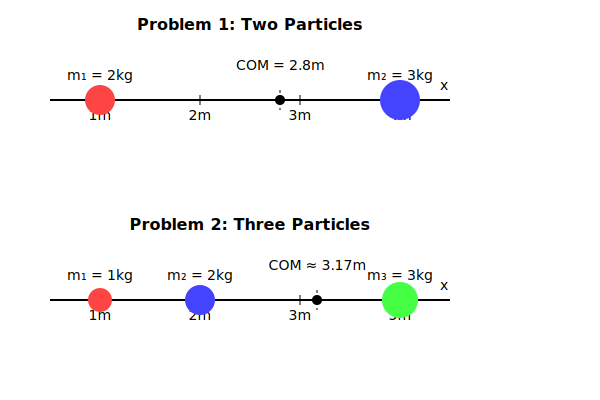

### INTRODUCTION 

The **center of mass (COM)** is a fundamental concept in physics that represents the average position of all the mass in a system. It is a crucial concept for analyzing the motion of systems of particles, rigid bodies, and extended objects. The center of mass simplifies the analysis of complex systems by allowing us to treat the entire system as a single point mass.

---

## Definition of Center of Mass

The center of mass is the point where the total mass of a system can be considered to be concentrated for the purpose of analyzing translational motion. Mathematically, the center of mass of a system of particles is given by:

$$
\vec{R}_{\text{COM}} = \frac{\sum_{i=1}^n m_i \vec{r}_i}{\sum_{i=1}^n m_i}
$$

where:
- $\vec{R}_{\text{COM}}$ = position vector of the center of mass
- $m_i$ = mass of the $i$-th particle
- $\vec{r}_i$ = position vector of the $i$-th particle
- $n$ = total number of particles

For a continuous mass distribution, the center of mass is given by:
$$
\vec{R}_{\text{COM}} = \frac{\int \vec{r} \, dm}{\int dm}
$$

---

## Key Principles of Center of Mass

### 1. **Motion of the Center of Mass**
The center of mass of a system moves as if all the mass of the system were concentrated at that point, and all external forces were applied there. The motion of the center of mass is governed by:
$$
\vec{F}_{\text{ext}} = M \vec{a}_{\text{COM}}
$$

where:
- $\vec{F}_{\text{ext}}$ = net external force on the system
- $M$ = total mass of the system
- $\vec{a}_{\text{COM}}$ = acceleration of the center of mass

### 2. **Center of Mass in Symmetrical Objects**
For objects with uniform density and symmetrical shapes, the center of mass lies at the geometric center. For example:
- **Sphere**: Center of mass at the center of the sphere.
- **Cube**: Center of mass at the intersection of the diagonals.
- **Cylinder**: Center of mass at the midpoint of the axis.

### 3. **Center of Mass in Systems with Multiple Objects**
For a system of multiple objects, the center of mass is calculated by treating each object as a point mass located at its own center of mass.

### 4. **Center of Mass and Stability**
The stability of an object depends on the location of its center of mass relative to its base of support. If the center of mass lies within the base of support, the object is stable. If it lies outside, the object may topple.

---

## Real-World Examples of Center of Mass

1. **Balancing a Seesaw**: The center of mass of a seesaw must be directly above the pivot point for it to balance.
2. **Rocket Motion**: The motion of a rocket can be analyzed by considering the center of mass of the rocket and its fuel.
3. **Sports**: Athletes often adjust their body positions to control their center of mass, such as in diving or gymnastics.
4. **Vehicles**: The stability of vehicles depends on the location of the center of mass relative to the base of support.
5. **Construction**: Engineers consider the center of mass when designing structures to ensure stability and safety.

---

## Common Misconceptions About Center of Mass

1. **Center of Mass is Always Inside the Object**: The center of mass can lie outside the object, especially in systems with irregular shapes or multiple objects.
2. **Center of Mass is the Same as the Geometric Center**: The center of mass coincides with the geometric center only for objects with uniform density and symmetrical shapes.
3. **Center of Mass is Fixed**: The center of mass can move if the distribution of mass in the system changes.
4. **Center of Mass is Only Relevant for Rigid Bodies**: The concept of center of mass applies to any system of particles, including fluids and gases.

---

## Equations of Center of Mass

1. **Center of Mass for Discrete Particles**:
   $$
   \vec{R}_{\text{COM}} = \frac{\sum_{i=1}^n m_i \vec{r}_i}{\sum_{i=1}^n m_i}
   $$

2. **Center of Mass for Continuous Mass Distribution**:
   $$
   \vec{R}_{\text{COM}} = \frac{\int \vec{r} \, dm}{\int dm}
   $$

3. **Motion of the Center of Mass**:
   $$
   \vec{F}_{\text{ext}} = M \vec{a}_{\text{COM}}
   $$

4. **Velocity of the Center of Mass**:
   $$
   \vec{V}_{\text{COM}} = \frac{\sum_{i=1}^n m_i \vec{v}_i}{\sum_{i=1}^n m_i}
   $$

5. **Momentum of the Center of Mass**:
   $$
   \vec{P}_{\text{COM}} = M \vec{V}_{\text{COM}}
   $$

---

## Center of Mass in Dynamic Systems

### Rotational Motion

The center of mass plays a fundamental role in rotational dynamics. When an object rotates freely in space, it naturally rotates about an axis passing through its center of mass. This principle has several important implications:

1. **Natural Rotation Axis**
The center of mass serves as the natural pivot point for rotation because:
- The net torque about this point due to gravity is zero
- The angular momentum about this point is conserved in the absence of external torques
- The rotational kinetic energy is minimized for rotation about this axis

2. **Parallel Axis Theorem**
For any rotating object, the moment of inertia $I$ about any axis is related to the moment of inertia about a parallel axis through the center of mass:

$$
I = I_{\text{CM}} + Md^2
$$

where:
- $I_{\text{CM}}$ is the moment of inertia about the center of mass
- $M$ is the total mass
- $d$ is the perpendicular distance between the axes

3. **Angular Momentum Conservation**
In the absence of external torques, the angular momentum $\vec{L}$ about the center of mass remains constant:

$$
\vec{L}_{\text{CM}} = \sum_i \vec{r}_i \times m_i\vec{v}_i = \text{constant}
$$

4. **Rotational Energy**
The total rotational kinetic energy can be separated into center of mass motion and rotation about the center of mass:

$$
K_{\text{total}} = \frac{1}{2}MV_{\text{CM}}^2 + \frac{1}{2}I_{\text{CM}}\omega^2
$$

### Center of Mass in Collisions

The behavior of the center of mass during collisions provides powerful insights into the dynamics of interacting systems. This concept is particularly useful because the center of mass motion remains simple even when the individual particles undergo complex interactions.

1. **Conservation of Linear Momentum**
During a collision, the velocity of the center of mass remains constant if no external forces act on the system:

$$
\vec{V}_{\text{COM}} = \frac{\sum_i m_i\vec{v}_i}{\sum_i m_i} = \text{constant}
$$

2. **Types of Collisions**

**Elastic Collisions**:
- Total kinetic energy is conserved
- Center of mass velocity remains unchanged
- Individual velocities change while preserving momentum:

$$
m_1\vec{v}_{1i} + m_2\vec{v}_{2i} = m_1\vec{v}_{1f} + m_2\vec{v}_{2f}
$$
$$
\frac{1}{2}m_1v_{1i}^2 + \frac{1}{2}m_2v_{2i}^2 = \frac{1}{2}m_1v_{1f}^2 + \frac{1}{2}m_2v_{2f}^2
$$

**Inelastic Collisions**:
- Kinetic energy is not conserved
- Center of mass velocity remains unchanged
- Objects may stick together after collision:

$$
\vec{V}_{\text{COM}} = \frac{m_1\vec{v}_1 + m_2\vec{v}_2}{m_1 + m_2} = \vec{v}_f
$$

3. **Reference Frame Transformation**
The center of mass frame provides a convenient reference for analyzing collisions:
- In this frame, the total momentum is zero
- The mathematics of collision analysis often simplifies
- The total kinetic energy in the CM frame is:

$$
K_{\text{CM}} = \frac{1}{2}\mu v_{\text{rel}}^2
$$

where $\mu$ is the reduced mass and $v_{\text{rel}}$ is the relative velocity.

4. **Applications in Particle Physics**
Center of mass analysis is crucial in particle physics:
- Collision experiments in accelerators
- Decay processes of unstable particles
- Conservation laws in nuclear reactions

Example: Two-Body Decay
When a particle at rest decays into two particles, conservation of momentum requires:

$$
\vec{p}_1 + \vec{p}_2 = 0
$$

The energies of the produced particles in the center of mass frame are:

$$
E_1 = \frac{M^2 + m_1^2 - m_2^2}{2M}, \quad E_2 = \frac{M^2 + m_2^2 - m_1^2}{2M}
$$

where $M$ is the mass of the original particle and $m_1$, $m_2$ are the masses of the products.

### Practical Applications

1. **Spacecraft Dynamics**:
- Attitude control using center of mass positioning
- Fuel consumption effects on rotation
- Docking maneuvers and stability

2. **Sports Physics**:
- Gymnastics rotations and balance
- Baseball bat sweet spot location
- Diving rotational mechanics

3. **Vehicle Design**:
- Stability in cornering
- Roll center calculation
- Weight distribution optimization

---

## Advanced Concepts in Center of Mass

### Non-Uniform Density Systems

In real-world applications, many objects and systems have varying density throughout their volume. This non-uniform density distribution significantly affects the position of the center of mass. To accurately determine the center of mass in such cases, we must consider how mass is distributed throughout the entire object.

For a continuous system with non-uniform density, we use calculus to integrate over the entire volume. The position vector of the center of mass is given by:

$$
\vec{R}_{\text{COM}} = \frac{\int \vec{r} \rho(\vec{r}) dV}{\int \rho(\vec{r}) dV}
$$

In this expression, $\rho(\vec{r})$ represents the density at position $\vec{r}$, and $dV$ is an infinitesimal volume element. The denominator gives the total mass of the system, while the numerator represents the mass-weighted position sum.

This formula has several important applications:

1. **Density Gradients**: In materials where density changes gradually, such as the atmosphere or ocean depths, the density function $\rho(\vec{r})$ might follow a specific mathematical pattern. For example, atmospheric density decreases approximately exponentially with height.

2. **Composite Materials**: For engineered materials with deliberately varied density, like functionally graded materials used in aerospace applications, the density function might be designed to optimize certain properties while maintaining a specific center of mass location.

### Mathematical Tools

To handle non-uniform density problems effectively, several mathematical techniques are essential:

**Multiple Integration**: For three-dimensional problems, triple integrals are often required:

$$
\vec{R}_{\text{COM}} = \frac{\iiint \vec{r} \rho(x,y,z) dx\,dy\,dz}{\iiint \rho(x,y,z) dx\,dy\,dz}
$$

**Coordinate Transformations**: Different coordinate systems may simplify the integration:
- Spherical coordinates for radially varying density
- Cylindrical coordinates for axially symmetric systems
- Curvilinear coordinates for specific geometries

### Applications and Examples

Let's explore some practical applications of center of mass calculations in non-uniform systems:

**Example 1: Half-Cylinder with Linear Density Variation**
Consider a half-cylinder of radius $R$ and length $L$ where density varies linearly with radius:
$$
\rho(r) = \rho_0 (1 + \frac{r}{R})
$$

The center of mass can be found using cylindrical coordinates:
$$
x_{\text{COM}} = \frac{\int_0^R \int_0^L \int_0^\pi r\cos\theta \cdot \rho_0(1 + \frac{r}{R})r\,d\theta\,dz\,dr}{\int_0^R \int_0^L \int_0^\pi \rho_0(1 + \frac{r}{R})r\,d\theta\,dz\,dr}
$$

**Example 2: Conical Shell with Height-Dependent Density**
For a conical shell where density varies with height:
$$
\rho(h) = \rho_0 e^{-h/H}
$$

The vertical position of the center of mass is:
$$
z_{\text{COM}} = \frac{\int_0^H h \cdot 2\pi r(h) \rho_0 e^{-h/H} dh}{\int_0^H 2\pi r(h) \rho_0 e^{-h/H} dh}
$$

where $r(h) = R(1 - \frac{h}{H})$ is the radius at height $h$.

### Practice Problems

**Problem 1: Non-uniform Rod**
A rod of length $L$ has a density that varies quadratically with distance from one end:
$$
\rho(x) = \rho_0(1 + \frac{x^2}{L^2})
$$
Find the position of the center of mass from the end where $x = 0$.

**Solution**:
The center of mass is given by:
$$
x_{\text{COM}} = \frac{\int_0^L x \rho_0(1 + \frac{x^2}{L^2}) dx}{\int_0^L \rho_0(1 + \frac{x^2}{L^2}) dx} = \frac{7L}{12}
$$

**Problem 2: Spherical Shell**
A thin spherical shell of radius $R$ has a density that varies with polar angle $\theta$:
$$
\rho(\theta) = \rho_0(1 + \cos\theta)
$$
Find the z-coordinate of the center of mass.

**Solution**:
Using spherical coordinates:
$$
z_{\text{COM}} = \frac{\int_0^\pi \int_0^{2\pi} R\cos\theta \cdot \rho_0(1 + \cos\theta)R^2\sin\theta\,d\phi\,d\theta}{\int_0^\pi \int_0^{2\pi} \rho_0(1 + \cos\theta)R^2\sin\theta\,d\phi\,d\theta} = \frac{R}{3}
$$

### Real-World Applications

1. **Aerospace Engineering**:
   - Aircraft design requires precise center of mass calculations for stability
   - Fuel consumption changes mass distribution during flight
   - Variable payload locations affect overall balance

2. **Civil Engineering**:
   - Building design must account for non-uniform material distribution
   - Dynamic loads can shift the effective center of mass
   - Structural stability depends on mass distribution

3. **Geophysics**:
   - Earth's internal structure studies
   - Tectonic plate movement analysis
   - Volcanic activity prediction

---

## Practice Problems

### Problem 1: Center of Mass of Two Particles
Two particles of masses 2 kg and 3 kg are located at positions $\vec{r}_1 = 1 \text{ m} \, \hat{i}$ and $\vec{r}_2 = 4 \text{ m} \, \hat{i}$, respectively. Find the center of mass of the system.

**Solution**:
Using the formula for the center of mass:

$$
\vec{R}_{\text{COM}} = \frac{m_1\vec{r}_1 + m_2\vec{r}_2}{m_1 + m_2}
$$

Substituting the values:
$$
\vec{R}_{\text{COM}} = \frac{(2\text{ kg})(1\text{ m}\hat{i}) + (3\text{ kg})(4\text{ m}\hat{i})}{2\text{ kg} + 3\text{ kg}}
$$

Simplifying:
$$
\vec{R}_{\text{COM}} = \frac{2\text{ kg}\cdot\text{m}\hat{i} + 12\text{ kg}\cdot\text{m}\hat{i}}{5\text{ kg}} = \frac{14\text{ kg}\cdot\text{m}\hat{i}}{5\text{ kg}} = 2.8\text{ m}\hat{i}
$$

### Problem 2: Center of Mass of Three Particles
Three particles of masses 1 kg, 2 kg, and 3 kg are located at positions $\vec{r}_1 = 0 \text{ m} \, \hat{i}$, $\vec{r}_2 = 2 \text{ m} \, \hat{i}$, and $\vec{r}_3 = 5 \text{ m} \, \hat{i}$, respectively. Find the center of mass of the system.

**Solution**:
Using the formula for the center of mass:

$$
\vec{R}_{\text{COM}} = \frac{m_1\vec{r}_1 + m_2\vec{r}_2 + m_3\vec{r}_3}{m_1 + m_2 + m_3}
$$

Substituting the values:
$$
\vec{R}_{\text{COM}} = \frac{(1\text{ kg})(0\text{ m}\hat{i}) + (2\text{ kg})(2\text{ m}\hat{i}) + (3\text{ kg})(5\text{ m}\hat{i})}{1\text{ kg} + 2\text{ kg} + 3\text{ kg}}
$$

Simplifying:
$$
\vec{R}_{\text{COM}} = \frac{0\text{ kg}\cdot\text{m}\hat{i} + 4\text{ kg}\cdot\text{m}\hat{i} + 15\text{ kg}\cdot\text{m}\hat{i}}{6\text{ kg}} = \frac{19\text{ kg}\cdot\text{m}\hat{i}}{6\text{ kg}} \approx 3.17\text{ m}\hat{i}
$$

### Problem 3: Center of Mass of a Rod
A rod of length 4 meters has a linear mass density $\lambda(x) = 2x \text{ kg/m}$, where $x$ is the distance from one end. Find the center of mass of the rod.

**Solution**:
The center of mass for a continuous mass distribution is given by:

$$
\vec{R}_{\text{COM}} = \frac{\int x \, dm}{\int dm}
$$

First, express $dm$ in terms of $dx$:

$$
dm = \lambda(x) \, dx = 2x \, dx
$$

Now, calculate the numerator and denominator:

$$
\int x \, dm = \int_0^4 x \cdot 2x \, dx = 2 \int_0^4 x^2 \, dx = 2 \left[ \frac{x^3}{3} \right]_0^4 = 2 \left( \frac{64}{3} \right) = \frac{128}{3} \text{ kg}\cdot\text{m}
$$

$$
\int dm = \int_0^4 2x \, dx = 2 \left[ \frac{x^2}{2} \right]_0^4 = 2 \left( 8 \right) = 16 \text{ kg}
$$

Thus, the center of mass is:

$$
\vec{R}_{\text{COM}} = \frac{\frac{128}{3} \text{ kg}\cdot\text{m}}{16 \text{ kg}} = \frac{128}{48} \text{ m} = \frac{8}{3} \text{ m} \approx 2.67 \text{ m}
$$

### Problem 4: Motion of the Center of Mass
Two objects of masses 2 kg and 3 kg are moving with velocities $\vec{v}_1 = 4 \text{ m/s} \, \hat{i}$ and $\vec{v}_2 = -2 \text{ m/s} \, \hat{i}$, respectively. Find the velocity of the center of mass of the system.

**Solution**:
The velocity of the center of mass is given by:

$$
\vec{V}_{\text{COM}} = \frac{m_1\vec{v}_1 + m_2\vec{v}_2}{m_1 + m_2}
$$

Substituting the values:

$$
\vec{V}_{\text{COM}} = \frac{(2\text{ kg})(4\text{ m/s}\hat{i}) + (3\text{ kg})(-2\text{ m/s}\hat{i})}{2\text{ kg} + 3\text{ kg}}
$$

Simplifying:

$$
\vec{V}_{\text{COM}} = \frac{8\text{ kg}\cdot\text{m/s}\hat{i} - 6\text{ kg}\cdot\text{m/s}\hat{i}}{5\text{ kg}} = \frac{2\text{ kg}\cdot\text{m/s}\hat{i}}{5\text{ kg}} = 0.4\text{ m/s}\hat{i}
$$

### Rotational Motion Problems

**Problem 1: Rotating Rod**
A uniform rod of length $L = 2$ m and mass $M = 3$ kg is rotating about its center with angular velocity $\omega = 5$ rad/s. Calculate:
a) The moment of inertia about its center
b) The angular momentum
c) The rotational kinetic energy

**Solution**:
a) For a rod about its center:
   - $I_{\text{CM}} = \frac{1}{12}ML^2 = \frac{1}{12} \times 3 \text{ kg} \times (2 \text{ m})^2 = 1 \text{ kg}\cdot\text{m}^2$

b) Angular momentum:
   - $L = I_{\text{CM}}\omega = 1 \text{ kg}\cdot\text{m}^2 \times 5 \text{ rad/s} = 5 \text{ kg}\cdot\text{m}^2/\text{s}$

c) Rotational kinetic energy:
   - $K = \frac{1}{2}I_{\text{CM}}\omega^2 = \frac{1}{2} \times 1 \text{ kg}\cdot\text{m}^2 \times (5 \text{ rad/s})^2 = 12.5 \text{ J}$

**Problem 2: Parallel Axis Theorem**
A disk of radius 20 cm and mass 2 kg rotates about an axis parallel to its diameter and 30 cm from its center. Calculate its moment of inertia.

**Solution**:
1. Calculate $I_{\text{CM}}$ for rotation about diameter:
   - $I_{\text{CM}} = \frac{1}{4}MR^2 = \frac{1}{4} \times 2 \text{ kg} \times (0.2 \text{ m})^2 = 0.02 \text{ kg}\cdot\text{m}^2$

2. Apply parallel axis theorem:
   - $I = I_{\text{CM}} + Md^2 = 0.02 + 2 \times (0.3)^2 = 0.2 \text{ kg}\cdot\text{m}^2$

### Collision Problems

**Problem 3: Elastic Collision**
Two particles with masses $m_1 = 2$ kg and $m_2 = 3$ kg collide elastically. Initially, $m_1$ moves at 4 m/s to the right while $m_2$ is at rest. Find:
a) The velocity of the center of mass
b) The final velocities of both particles

**Solution**:
a) Center of mass velocity:
   - $V_{\text{CM}} = \frac{m_1v_1}{m_1 + m_2} = \frac{2 \text{ kg} \times 4 \text{ m/s}}{5 \text{ kg}} = 1.6 \text{ m/s}$

b) Final velocities (using conservation of momentum and energy):
   - $v_{1f} = \frac{m_1 - m_2}{m_1 + m_2}v_{1i} = -0.8 \text{ m/s}$
   - $v_{2f} = \frac{2m_1}{m_1 + m_2}v_{1i} = 3.2 \text{ m/s}$

**Problem 4: Inelastic Collision**
A 3 kg object moving at 5 m/s collides and sticks to a 2 kg object moving in the opposite direction at 2 m/s. Calculate:
a) The final velocity
b) The energy lost in the collision

**Solution**:
a) Final velocity using momentum conservation:
   - $v_f = \frac{m_1v_1 + m_2v_2}{m_1 + m_2} = \frac{3(5) + 2(-2)}{5} = 2.2 \text{ m/s}$

b) Energy lost:
   - Initial KE = $\frac{1}{2}m_1v_1^2 + \frac{1}{2}m_2v_2^2 = 37.5 + 4 = 41.5 \text{ J}$
   - Final KE = $\frac{1}{2}(m_1 + m_2)v_f^2 = 12.1 \text{ J}$
   - Energy lost = $29.4 \text{ J}$

**Problem 5: Two-Dimensional Collision**
A 2 kg ball moving at 3 m/s collides elastically with a 1 kg ball at rest. After collision, the 2 kg ball moves at 30° to its original direction. Find:
a) The velocity of the 2 kg ball after collision
b) The velocity and direction of the 1 kg ball after collision

**Solution**:
a) Using conservation of energy and 30° angle:
   - $v_{1f} = 2.60 \text{ m/s}$

b) Using momentum conservation:
   - $v_{2f} = 2.83 \text{ m/s}$
   - $\theta_2 = 41.8°$

**Problem 6: Angular Momentum Conservation**
A figure skater spinning at 2 rev/s with arms extended (I = 3 kg⋅m²) pulls their arms in, reducing their moment of inertia to 1 kg⋅m². Calculate their new angular velocity.

**Solution**:
Using conservation of angular momentum:
- $L = I_1\omega_1 = I_2\omega_2$
- $\omega_2 = \frac{I_1\omega_1}{I_2} = \frac{3 \times 4\pi}{1} = 12\pi \text{ rad/s} = 6 \text{ rev/s}$

### Advanced Problems

**Problem 7: Combined Motion**
A uniform rod of length 2L pivots about one end and falls from a vertical position. Find:
a) The angular acceleration at any angle θ
b) The linear acceleration of the center of mass
c) The tension in the pivot

**Solution**:
a) Angular acceleration:
   - $\alpha = \frac{3g}{2L}\sin\theta$

b) Center of mass acceleration:
   - $a_{\text{CM}} = L\alpha = \frac{3g}{2}\sin\theta$

c) Tension at pivot:
   - $T = \frac{3}{2}mg\cos\theta$

**Problem 8: Particle Decay**
A particle of mass 3 GeV/c² at rest decays into two particles of masses 1 GeV/c² and 1.5 GeV/c². Calculate:
a) The energy of each particle
b) The momentum of each particle

**Solution**:
a) Using the mass-energy formula:
   - $E_1 = \frac{9 + 1 - 2.25}{6} = 1.29 \text{ GeV}$
   - $E_2 = \frac{9 + 2.25 - 1}{6} = 1.71 \text{ GeV}$

b) Momentum (same magnitude, opposite directions):
   - $p = \sqrt{E_1^2 - m_1^2} = 0.81 \text{ GeV/c}$
