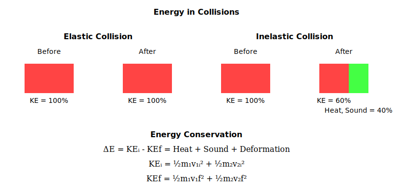
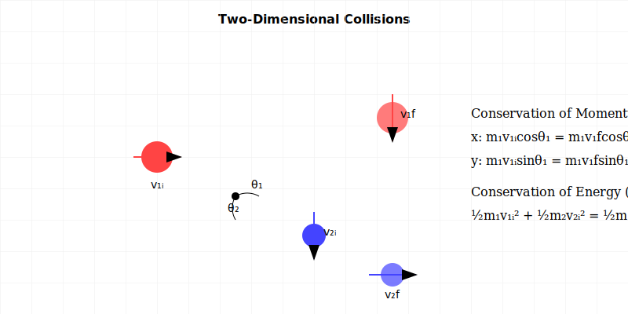

## Introduction
Collisions are interactions between objects that result in a change in their motion. They are a fundamental concept in physics and are crucial for analyzing the behavior of objects during interactions. Collisions can be classified into different types based on whether kinetic energy is conserved.

---

## Types of Collisions

### 1. **Elastic Collisions**

An elastic collision represents an idealized case where both momentum and kinetic energy are perfectly conserved. While rare in the real world, it serves as a useful model for certain interactions.

#### Key Characteristics:

1. **Conservation of Momentum**:
   $$
   \vec{p}_{\text{initial}} = \vec{p}_{\text{final}}
   $$
   $$
   m_1\vec{v}_{1i} + m_2\vec{v}_{2i} = m_1\vec{v}_{1f} + m_2\vec{v}_{2f}
   $$

2. **Conservation of Energy**:
   $$
   KE_{\text{initial}} = KE_{\text{final}}
   $$
   $$
   \frac{1}{2}m_1v_{1i}^2 + \frac{1}{2}m_2v_{2i}^2 = \frac{1}{2}m_1v_{1f}^2 + \frac{1}{2}m_2v_{2f}^2
   $$

3. **Special Cases**:
   - For equal masses ($m_1 = m_2$):
     $$
     \vec{v}_{1f} = \vec{v}_{2i}, \quad \vec{v}_{2f} = \vec{v}_{1i}
     $$
   - For one object initially at rest:
     $$
     v_{2f} = \frac{2m_1}{m_1 + m_2}v_{1i}
     $$

#### Examples:
- Atomic collisions
- Billiard ball collisions
- Ideal gas molecule interactions
- Collisions between superballs

---

### 2. **Inelastic Collisions**

In an inelastic collision, while momentum is conserved, some kinetic energy is converted into other forms such as heat, sound, or deformation energy.

#### Key Characteristics:

1. **Conservation of Momentum**:
   $$
   \vec{p}_{\text{initial}} = \vec{p}_{\text{final}}
   $$
   $$
   m_1\vec{v}_{1i} + m_2\vec{v}_{2i} = m_1\vec{v}_{1f} + m_2\vec{v}_{2f}
   $$

2. **Energy Transformation**:
   $$
   KE_{\text{initial}} > KE_{\text{final}}
   $$
   $$
   \Delta E = KE_{\text{initial}} - KE_{\text{final}} = E_{\text{heat}} + E_{\text{sound}} + E_{\text{deformation}}
   $$

3. **Coefficient of Restitution**:
   $$
   0 < e < 1
   $$
   where $e$ measures the "bounciness" of the collision

#### Examples:
- Car collisions
- Sports ball impacts
- Molecular collisions with energy transfer
- Colliding pendulums

#### Energy Considerations:
- Some kinetic energy is always lost
- Energy is transformed, not destroyed
- Heat generation is often the primary energy sink
- Deformation may be temporary or permanent

---

### 3. **Perfectly Inelastic Collisions**

A perfectly inelastic collision occurs when objects stick together after impact, resulting in the maximum possible loss of kinetic energy while conserving momentum.

#### Key Characteristics:

1. **Conservation of Momentum**:
   $$
   \vec{p}_{\text{initial}} = \vec{p}_{\text{final}}
   $$
   $$
   m_1\vec{v}_{1i} + m_2\vec{v}_{2i} = (m_1 + m_2)\vec{v}_f
   $$

2. **Final Velocity**:
   $$
   \vec{v}_f = \frac{m_1\vec{v}_{1i} + m_2\vec{v}_{2i}}{m_1 + m_2}
   $$

3. **Energy Loss**:
   - Initial kinetic energy:
     $$
     KE_i = \frac{1}{2}m_1v_{1i}^2 + \frac{1}{2}m_2v_{2i}^2
     $$
   - Final kinetic energy:
     $$
     KE_f = \frac{1}{2}(m_1 + m_2)v_f^2
     $$
   - Always true: $KE_f < KE_i$

#### Examples:
- Bullet embedding in a block
- Clay balls colliding and sticking
- Vehicle crashes with permanent deformation

---

## Key Principles of Collisions

### 1. **Conservation of Momentum**
In all types of collisions, the total momentum of the system is conserved. This principle is expressed as:
$$
\vec{p}_{\text{initial}} = \vec{p}_{\text{final}}
$$

### 2. **Coefficient of Restitution**
The **coefficient of restitution (e)** is a measure of how "bouncy" a collision is. It is defined as the ratio of the relative velocity after the collision to the relative velocity before the collision:
$$
e = \frac{v_{\text{final, relative}}}{v_{\text{initial, relative}}}
$$
- For **elastic collisions**: \( e = 1 \)
- For **inelastic collisions**: \( 0 < e < 1 \)
- For **perfectly inelastic collisions**: \( e = 0 \)

---

## Energy in Collisions

### 1. Kinetic Energy

Initial kinetic energy:
$$
KE_{\text{initial}} = \frac{1}{2} m_1 v_1^2 + \frac{1}{2} m_2 v_2^2
$$
Final kinetic energy:
$$
KE_{\text{final}} = \frac{1}{2} m_1 v_1'^2 + \frac{1}{2} m_2 v_2'^2
$$

---

## Two-Dimensional Collisions

When objects collide in two dimensions, their interaction becomes more complex than in one-dimensional cases. Consider a billiard ball striking another at an angle: the resulting motion occurs in both x and y directions simultaneously. In these collisions, momentum conservation applies independently to each direction, following $p_{1x} + p_{2x} = p_{1x}' + p_{2x}'$ for the x-direction and $p_{1y} + p_{2y} = p_{1y}' + p_{2y}'$ for the y-direction.

The analysis of two-dimensional collisions requires vector mathematics. The initial velocities $\vec{v}_1$ and $\vec{v}_2$ and final velocities $\vec{v}_1'$ and $\vec{v}_2'$ must be broken into their x and y components. For elastic collisions, not only is momentum conserved in both directions, but the total kinetic energy remains unchanged: $\frac{1}{2}m_1v_1^2 + \frac{1}{2}m_2v_2^2 = \frac{1}{2}m_1v_1'^2 + \frac{1}{2}m_2v_2'^2$.

The conservation equations shown in the diagram describe this mathematically. For momentum conservation in the x-direction:

$m_1v_{1i}\cos\theta_1 = m_1v_{1f}\cos\theta_{1f} + m_2v_{2f}\cos\theta_{2f}$

And in the y-direction:

$m_1v_{1i}\sin\theta_1 = m_1v_{1f}\sin\theta_{1f} + m_2v_{2f}\sin\theta_{2f}$

Here, $\theta_1$ represents the initial angle of approach, while $\theta_{1f}$ and $\theta_{2f}$ are the final scattering angles of the two objects. The subscript i denotes initial values, and f denotes final values. These equations account for both the magnitude and direction of momentum, ensuring its conservation in both dimensions.

For elastic collisions, we also have the conservation of kinetic energy:

$\frac{1}{2}m_1v_{1i}^2 + \frac{1}{2}m_2v_{2i}^2 = \frac{1}{2}m_1v_{1f}^2 + \frac{1}{2}m_2v_{2f}^2$

A practical example is found in atomic and molecular collisions, where particles scatter at various angles. The scattering angle θ depends on the impact parameter b, which measures the offset of the collision from head-on. This relationship provides valuable information about atomic and molecular structures in experimental physics.

In partially elastic collisions, like those between pool balls, some kinetic energy converts to other forms due to friction and deformation, but momentum conservation still holds in both directions. The coefficient of restitution e, which ranges from 0 to 1, quantifies the elasticity of these collisions, affecting the final velocities while maintaining momentum conservation.

---

## Real-World Examples of Collisions

### 1. Vehicle Collisions
- **Type**: Typically inelastic
- **Energy Transformation**: 
  - Kinetic → Deformation
  - Kinetic → Heat
  - Kinetic → Sound
- **Safety Features**: Crumple zones designed for controlled energy absorption

### 2. Sports Physics
- **Billiards/Pool**:
  - Nearly elastic collisions
  - Minimal energy loss
  - Angular momentum conservation
- **Tennis/Baseball**:
  - Partially elastic collisions
  - Coefficient of restitution crucial
  - Speed and spin effects

### 3. Particle Physics
- **Atomic Collisions**:
  - Highly elastic
  - Used in particle accelerators
  - Study of fundamental forces
- **Nuclear Fusion**:
  - High-energy collisions
  - Mass-energy conversion
  - Stellar processes

### 4. Space Physics
- **Satellite Collisions**:
  - Orbital debris problems
  - High relative velocities
  - Cascade effects
- **Planetary Impacts**:
  - Formation of moons
  - Crater formation
  - Mass ejection

---

## Key Points to Remember

### 1. Conservation Laws
- **Momentum**: Always conserved in isolated systems
- **Energy**: Only conserved in elastic collisions
- **Angular Momentum**: Conserved in rotational collisions

### 2. Energy Transformation
- **Elastic**: $KE_i = KE_f$
- **Inelastic**: $KE_i > KE_f$
- **Perfectly Inelastic**: Maximum $KE$ loss

### 3. Coefficient of Restitution
- $e = 1$: Perfectly elastic
- $0 < e < 1$: Partially elastic
- $e = 0$: Perfectly inelastic

### 4. Two-Dimensional Analysis
- Separate into x and y components
- Both components conserve momentum
- Use trigonometry for angular calculations

### 5. Common Applications
- Vehicle safety design
- Sports equipment optimization
- Particle physics research
- Space debris tracking

## Equations of Collisions

1. **Conservation of Momentum**:
   $$
   \vec{p}_{\text{initial}} = \vec{p}_{\text{final}}
   $$

2. **Elastic Collision (1D)**:
   - Conservation of momentum:
     $$
     m_1 v_1 + m_2 v_2 = m_1 v_1' + m_2 v_2'
     $$
   - Conservation of kinetic energy:
     $$
     \frac{1}{2} m_1 v_1^2 + \frac{1}{2} m_2 v_2^2 = \frac{1}{2} m_1 v_1'^2 + \frac{1}{2} m_2 v_2'^2
     $$

3. **Perfectly Inelastic Collision (1D)**:
   - Conservation of momentum:
     $$
     m_1 v_1 + m_2 v_2 = (m_1 + m_2) v_f
     $$
   - Final velocity:
     $$
     v_f = \frac{m_1 v_1 + m_2 v_2}{m_1 + m_2}
     $$

4. **Coefficient of Restitution**:
   $$
   e = \frac{v_{\text{final, relative}}}{v_{\text{initial, relative}}}
   $$

---

## Advanced Concepts in Collisions

### Center of Mass in Collision Systems

In collision analysis, the center of mass provides a powerful perspective on system behavior. For an isolated system of colliding objects, the center of mass maintains uniform motion regardless of the collision's complexity. We can express the center of mass velocity as $\vec{V}_{COM} = \frac{m_1\vec{v}_1 + m_2\vec{v}_2}{m_1 + m_2}$. This equation reveals that heavier objects influence the system's overall motion more strongly than lighter ones.

Understanding center of mass motion simplifies many collision problems. By switching to the center of mass reference frame, complex collisions often become more manageable. In this frame, the total momentum always equals zero, and the motion of the colliding objects becomes symmetric about the center of mass.

### Relativistic Collision Physics

When collision velocities approach the speed of light, Newtonian mechanics no longer provides accurate predictions. Relativistic effects become significant, fundamentally changing how we calculate momentum and energy. The relativistic momentum equation becomes $\vec{p} = \gamma m\vec{v}$, where $\gamma$ is the Lorentz factor given by $\gamma = \frac{1}{\sqrt{1 - \frac{v^2}{c^2}}}$. This factor approaches infinity as velocity approaches the speed of light, preventing objects with mass from reaching light speed.

The total energy in relativistic collisions follows $E = \gamma mc^2$, Einstein's famous mass-energy relationship. This equation shows that even stationary objects possess enormous energy through their mass alone. During high-energy collisions, this rest energy can transform into other forms, including the creation of new particles—a phenomenon observed in particle accelerators.

These relativistic effects manifest in particle physics experiments, where protons collide at speeds exceeding 99% of light speed. At these velocities, the increased momentum and energy from the Lorentz factor significantly affect collision outcomes, leading to the creation of new particles and the observation of fundamental physical processes.

---

## Practice Problems

### Problem 1: Elastic Collision Analysis

A billiard ball ($m_1 = 0.2\text{ kg}$) moving at $3\text{ m/s}\hat{i}$ collides elastically with a stationary ball of the same mass. After collision, the first ball moves at $30°$ to the original direction.

**Find**:
1. The velocity of the first ball after collision
2. The velocity of the second ball after collision

**Solution**:

1) Use conservation of momentum:
   $$
   \vec{p}_i = \vec{p}_f
   $$
   $$
   m_1\vec{v}_{1i} = m_1\vec{v}_{1f} + m_1\vec{v}_{2f}
   $$

2) For elastic collision, energy is conserved:
   $$
   \frac{1}{2}m_1v_{1i}^2 = \frac{1}{2}m_1v_{1f}^2 + \frac{1}{2}m_1v_{2f}^2
   $$

3) From given angle:
   $$
   v_{1f} = v_{1i}\cos(30°) = 3\text{ m/s} \times 0.866 = 2.6\text{ m/s}
   $$

4) Using energy conservation:
   $$
   v_{2f} = 1.5\text{ m/s}
   $$

5) Final velocities:
   - Ball 1: $\vec{v}_{1f} = 2.6\text{ m/s}$ at $30°$
   - Ball 2: $\vec{v}_{2f} = 1.5\text{ m/s}$ at $-60°$

### Problem 2: Inelastic Collision with Energy Loss

A $4\text{ kg}$ cart moving at $5\text{ m/s}\hat{i}$ collides with a stationary $6\text{ kg}$ cart. They stick together after collision.

**Find**:
1. The final velocity
2. The energy lost in collision

**Solution**:

1) For perfectly inelastic collision:
   $$
   \vec{v}_f = \frac{m_1\vec{v}_{1i} + m_2\vec{v}_{2i}}{m_1 + m_2}
   $$

2) Substitute values:
   $$
   \vec{v}_f = \frac{(4\text{ kg})(5\text{ m/s}\hat{i}) + (6\text{ kg})(0)}{4\text{ kg} + 6\text{ kg}}
   $$
   $$
   \vec{v}_f = 2\text{ m/s}\hat{i}
   $$

3) Initial kinetic energy:
   $$
   KE_i = \frac{1}{2}m_1v_{1i}^2 = \frac{1}{2}(4\text{ kg})(5\text{ m/s})^2 = 50\text{ J}
   $$

4) Final kinetic energy:
   $$
   KE_f = \frac{1}{2}(m_1 + m_2)v_f^2 = \frac{1}{2}(10\text{ kg})(2\text{ m/s})^2 = 20\text{ J}
   $$

5) Energy lost:
   $$
   \Delta E = KE_i - KE_f = 50\text{ J} - 20\text{ J} = 30\text{ J}
   $$

The system lost $30\text{ J}$ of energy to heat, sound, and deformation.

### Problem 3: Coefficient of Restitution

A rubber ball is dropped from $h_1 = 1.8\text{ m}$ and bounces to $h_2 = 1.2\text{ m}$.

**Find**:
1. The coefficient of restitution
2. The height of the next bounce
3. The velocity just before hitting the ground

**Solution**:

1) Using height ratio:
   $$
   e = \sqrt{\frac{h_2}{h_1}} = \sqrt{\frac{1.2\text{ m}}{1.8\text{ m}}} = 0.816
   $$

2) Next bounce height:
   $$
   h_3 = h_2e^2 = (1.2\text{ m})(0.816)^2 = 0.8\text{ m}
   $$

3) Velocity before impact:
   $$
   v = \sqrt{2gh_1} = \sqrt{2(9.81\text{ m/s}^2)(1.8\text{ m})} = 5.94\text{ m/s}
   $$

The ball will continue bouncing with each height reduced by a factor of $e^2$.

---
