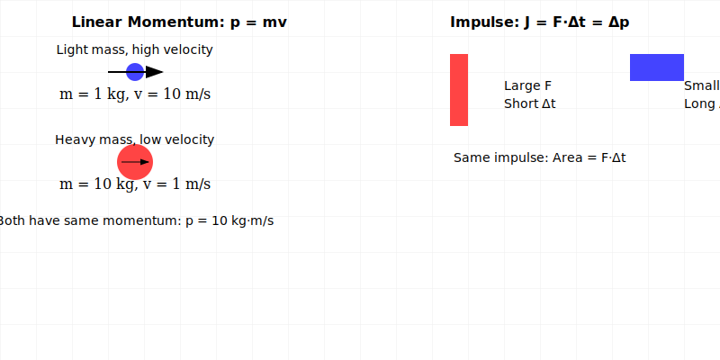
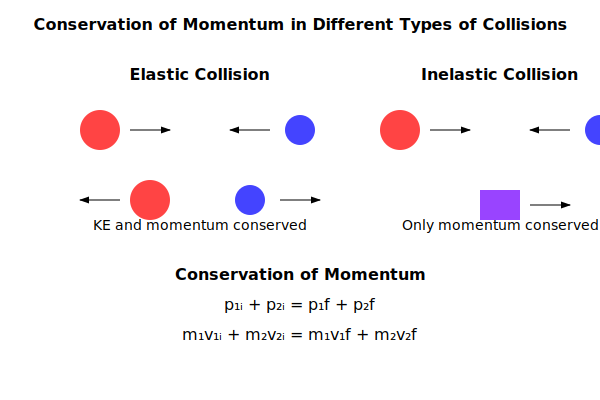

### INTRODUCTION

Momentum is a fundamental concept in physics that describes the motion of an object. It is a vector quantity that depends on both the mass and velocity of the object. Momentum is crucial for analyzing collisions, explosions, and other interactions between objects.

## Definition of Momentum

### Linear Momentum and Impulse

Linear momentum represents an object's motion quantity, combining both its mass and velocity. When an object moves, it possesses momentum given by the equation $\vec{p} = m\vec{v}$. This relationship shows that a moving object's momentum increases with either greater mass or higher velocity.

As a vector quantity, momentum points in the same direction as velocity. This means that momentum carries information about not just how much motion an object has, but also which way it's moving. In three dimensions, we can analyze momentum along each axis separately, breaking it into components $p_x$, $p_y$, and $p_z$.

The standard unit for momentum is kilogram-meters per second (kg⋅m/s), also expressible as Newton-seconds (N⋅s). This unit emerges naturally from the dimensional analysis of mass times velocity [M][L][T]⁻¹.

When examining multiple objects together, we consider their combined momentum. For a system of n particles, the total momentum equals the sum of individual momenta: $\vec{P}_{\text{total}} = \sum_{i=1}^n m_i\vec{v}_i$. This additive property makes momentum particularly useful for analyzing complex systems.

Force and momentum are intimately connected through Newton's Second Law: $\vec{F} = \frac{d\vec{p}}{dt} = m\frac{d\vec{v}}{dt} = m\vec{a}$. This equation reveals that force equals the rate of momentum change, explaining why changing the momentum of more massive objects requires greater force.

In everyday situations, momentum manifests in various ways. A heavy truck moving slowly and a light bullet moving very fast can have the same momentum, despite their vastly different masses and velocities. For instance, a 1000 kg car at 10 m/s and a 0.1 kg bullet at 100 m/s both have a momentum of 10,000 kg⋅m/s, demonstrating how mass and velocity can compensate for each other.

An object's momentum depends on our reference frame. A parked car has zero momentum relative to the ground but significant momentum relative to a moving train. In isolated systems where no external forces act, the total momentum remains constant—a fundamental principle known as conservation of momentum.

### Conservation of Momentum

Conservation of momentum stands as one of physics' most fundamental principles. In an isolated system, where no external forces act, the total momentum remains constant, expressed mathematically as $\vec{p}_{\text{initial}} = \vec{p}_{\text{final}}$. This principle operates independently along each direction, with momentum conserved separately in the x, y, and z directions.

For this conservation to hold true, we must carefully define our system boundaries. The system must include all objects involved in the interaction while excluding external forces like friction or air resistance that could alter the total momentum. During very brief interactions, such as collisions, we can often ignore these external effects due to their minimal impact over short time scales.

Collisions provide an excellent demonstration of momentum conservation. In elastic collisions, both momentum and kinetic energy remain constant, following $m_1\vec{v}_{1i} + m_2\vec{v}_{2i} = m_1\vec{v}_{1f} + m_2\vec{v}_{2f}$. Inelastic collisions preserve momentum but not kinetic energy, with perfectly inelastic collisions resulting in objects sticking together, described by $m_1\vec{v}_{1i} + m_2\vec{v}_{2i} = (m_1 + m_2)\vec{v}_f$.

This principle extends beyond collisions to various phenomena. In explosions and decay processes, a single object splits into multiple parts, with the initial momentum equaling the sum of final momenta. Recoil motion, seen in firearms and rocket propulsion, demonstrates this principle through the equation $m_{\text{gun}}\vec{v}_{\text{gun}} = -m_{\text{bullet}}\vec{v}_{\text{bullet}}$, showing how the momenta of separating objects must balance.

We observe momentum conservation throughout nature, from billiard ball collisions to subatomic particle interactions. In sports, ice hockey puck collisions perfectly demonstrate elastic collisions, while car crashes illustrate inelastic ones. Rocket propulsion relies on this principle, with exhaust gases' backward momentum balanced by the rocket's forward motion.

However, it's crucial to understand when momentum conservation applies. While many assume momentum is always conserved, this only holds true in isolated systems. External forces like friction or air resistance can change the total momentum. Additionally, momentum conservation doesn't always coincide with energy conservation—inelastic collisions preserve momentum while losing kinetic energy to heat and deformation.

The principle's directional nature often surprises students. Momentum conserves independently in each direction, allowing for partial conservation in systems with directional forces. For instance, a ball bouncing on a frictionless surface maintains horizontal momentum while vertical momentum changes due to gravity.

### Examples in Nature

1. **Moving Objects**:
   - A 1000 kg car moving at 10 m/s has momentum of 10,000 kg·m/s
   - A 0.1 kg bullet moving at 100 m/s has momentum of 10 kg·m/s

2. **Relative Effects**:
   - Mass dominant: Trucks have large momentum due to mass
   - Velocity dominant: Bullets have large momentum due to speed
   - Equal momentum: Different combinations of mass and velocity

3. **Zero Momentum**:
   - Stationary objects
   - Objects moving perpendicular to reference direction
   - Systems with equal and opposite momenta

---

## Key Principles of Momentum

### 1. **Conservation of Momentum**

Conservation of momentum stands as one of physics' most fundamental principles. In an isolated system, where no external forces act, the total momentum remains constant, expressed mathematically as $\vec{p}_{\text{initial}} = \vec{p}_{\text{final}}$. This principle operates independently along each direction, with momentum conserved separately in the x, y, and z directions.

For this conservation to hold true, we must carefully define our system boundaries. The system must include all objects involved in the interaction while excluding external forces like friction or air resistance that could alter the total momentum. During very brief interactions, such as collisions, we can often ignore these external effects due to their minimal impact over short time scales.

Collisions provide an excellent demonstration of momentum conservation. In elastic collisions, both momentum and kinetic energy remain constant, following $m_1\vec{v}_{1i} + m_2\vec{v}_{2i} = m_1\vec{v}_{1f} + m_2\vec{v}_{2f}$. Inelastic collisions preserve momentum but not kinetic energy, with perfectly inelastic collisions resulting in objects sticking together, described by $m_1\vec{v}_{1i} + m_2\vec{v}_{2i} = (m_1 + m_2)\vec{v}_f$.

This principle extends beyond collisions to various phenomena. In explosions and decay processes, a single object splits into multiple parts, with the initial momentum equaling the sum of final momenta. Recoil motion, seen in firearms and rocket propulsion, demonstrates this principle through the equation $m_{\text{gun}}\vec{v}_{\text{gun}} = -m_{\text{bullet}}\vec{v}_{\text{bullet}}$, showing how the momenta of separating objects must balance.

We observe momentum conservation throughout nature, from billiard ball collisions to subatomic particle interactions. In sports, ice hockey puck collisions perfectly demonstrate elastic collisions, while car crashes illustrate inelastic ones. Rocket propulsion relies on this principle, with exhaust gases' backward momentum balanced by the rocket's forward motion.

However, it's crucial to understand when momentum conservation applies. While many assume momentum is always conserved, this only holds true in isolated systems. External forces like friction or air resistance can change the total momentum. Additionally, momentum conservation doesn't always coincide with energy conservation—inelastic collisions preserve momentum while losing kinetic energy to heat and deformation.

The principle's directional nature often surprises students. Momentum conserves independently in each direction, allowing for partial conservation in systems with directional forces. For instance, a ball bouncing on a frictionless surface maintains horizontal momentum while vertical momentum changes due to gravity.

#### Key Aspects of Conservation

1. **Isolated Systems**:
   - No external forces acting
   - Internal forces cannot change total momentum
   - Examples: collisions, explosions, recoil

2. **Vector Conservation**:
   - Momentum is conserved in each direction independently
   - For x-direction: $p_{x,\text{initial}} = p_{x,\text{final}}$
   - For y-direction: $p_{y,\text{initial}} = p_{y,\text{final}}$
   - For z-direction: $p_{z,\text{initial}} = p_{z,\text{final}}$

3. **System Boundaries**:
   - Must include all interacting objects
   - Can exclude objects with negligible effect
   - External forces break conservation
   - Example: friction, air resistance

#### Applications

1. **Collisions**:
   - Elastic: Both momentum and kinetic energy conserved
     $$
     m_1\vec{v}_{1i} + m_2\vec{v}_{2i} = m_1\vec{v}_{1f} + m_2\vec{v}_{2f}
     $$
   - Inelastic: Only momentum conserved
   - Perfect inelastic: Objects stick together
     $$
     m_1\vec{v}_{1i} + m_2\vec{v}_{2i} = (m_1 + m_2)\vec{v}_f
     $$

2. **Explosions and Decay**:
   - Single object splits into multiple parts
   - Initial momentum equals sum of final momenta
   - Examples:
     - Fireworks
     - Nuclear decay
     - Molecular dissociation

3. **Recoil Motion**:
   - Gun firing a bullet
   - Rocket propulsion
   - Jumping from rest
   $$
   m_{\text{gun}}\vec{v}_{\text{gun}} = -m_{\text{bullet}}\vec{v}_{\text{bullet}}
   $$

#### Conservation Rules

1. **When Momentum is Conserved**:
   - Isolated systems
   - Negligible external forces
   - During very brief interactions
   - In the center of mass frame

2. **When Momentum is Not Conserved**:
   - Significant friction
   - Air resistance
   - External forces applied
   - Ground forces present

3. **Partial Conservation**:
   - Conservation in specific directions
   - Example: Horizontal motion with vertical forces
   - Systems with symmetry

#### Real-World Examples

1. **Sports**:
   - Billiard ball collisions
   - Ice hockey puck collisions
   - Diving board momentum transfer

2. **Transportation**:
   - Car collisions
   - Rocket propulsion
   - Jet engine thrust

3. **Particle Physics**:
   - Subatomic particle collisions
   - Nuclear reactions
   - Particle decay processes

#### Common Misconceptions

1. **External Forces**:
   - Misconception: Momentum is always conserved
   - Reality: Only in isolated systems

2. **Energy Conservation**:
   - Misconception: Energy and momentum conservation always occur together
   - Reality: Momentum can be conserved when energy isn't

3. **Direction**:
   - Misconception: Conservation only in collision direction
   - Reality: Conservation in all directions independently

### 2. **Impulse and Momentum**
When a force acts on an object over a period of time, it causes a change in the object's momentum. This change in momentum is called impulse, and it represents the cumulative effect of force applied over time. The relationship between impulse and momentum is fundamental to understanding everything from rocket propulsion to sports physics.

The mathematical expression for impulse is:

$$
\vec{J} = \Delta\vec{p} = \vec{F}\Delta t
$$

Here, $\vec{J}$ represents the impulse measured in Newton-seconds (N⋅s) or kilogram-meters per second (kg⋅m/s), $\vec{F}$ is the applied force in Newtons (N), and $\Delta t$ is the time interval in seconds (s). This equation reveals a crucial insight: we can achieve the same change in momentum either by applying a large force for a short time or a smaller force for a longer time.

This principle explains many practical applications. For instance, airbags in cars extend the time of impact during a collision, reducing the force experienced by passengers. Similarly, athletes bend their knees when landing from a jump to increase the time of impact, thereby reducing the force on their joints.

### 3. **Momentum in Collisions**
The conservation of momentum in collisions is one of the most powerful principles in physics. When objects collide, their total momentum remains constant, provided no external forces act on the system. However, the nature of the collision determines what happens to the objects' kinetic energy.

#### Elastic Collisions

In an elastic collision, both momentum and kinetic energy are preserved. These collisions are idealized cases that occur when the interacting objects are perfectly rigid and no energy is converted to heat or deformation. The collision between two billiard balls is a close approximation of an elastic collision. For two objects colliding head-on, the final velocities ($v_{1f}$ and $v_{2f}$) can be determined from their initial velocities ($v_{1i}$ and $v_{2i}$) using:

$$
v_{1f} = \frac{(m_1 - m_2)v_{1i} + 2m_2v_{2i}}{m_1 + m_2}
$$

$$
v_{2f} = \frac{2m_1v_{1i} + (m_2 - m_1)v_{2i}}{m_1 + m_2}
$$

#### Inelastic Collisions

Real-world collisions are typically inelastic, where some kinetic energy is converted to other forms such as heat, sound, or deformation of the objects. While momentum is still conserved, the final kinetic energy is less than the initial kinetic energy. The amount of energy "lost" depends on the materials involved and the nature of the collision.

#### Perfectly Inelastic Collisions

The extreme case is a perfectly inelastic collision, where the colliding objects stick together after impact. Consider two objects of masses $m_1$ and $m_2$ moving with initial velocities $v_1$ and $v_2$. After a perfectly inelastic collision, they move together with a common velocity $v_f$ given by:

$$
v_f = \frac{m_1v_1 + m_2v_2}{m_1 + m_2}
$$

This equation comes directly from the conservation of momentum, as the final momentum must equal the initial momentum of the system. A classic example is a bullet embedding itself in a wooden block, where the bullet and block move together after impact.

The energy "lost" in a perfectly inelastic collision can be calculated as:

$$
\Delta E = \frac{1}{2}\frac{m_1m_2}{m_1 + m_2}(v_1 - v_2)^2
$$

This lost energy typically transforms into thermal energy and permanent deformation of the colliding objects. Understanding these energy transformations is crucial in engineering applications, from designing crash barriers to developing protective sports equipment.

---

## Real-World Applications of Momentum

### Collision Analysis and Engineering

The study of collisions through momentum conservation principles forms the backbone of many engineering applications. In elastic collisions, both momentum and kinetic energy are preserved, leading to the fundamental equations:

$$
m_1\vec{v}_{1i} + m_2\vec{v}_{2i} = m_1\vec{v}_{1f} + m_2\vec{v}_{2f}
$$

This principle governs phenomena from atomic collisions in particle accelerators to the design of sports equipment. In tennis racket design, for instance, engineers optimize the "sweet spot" by analyzing the elastic collision between the ball and racket strings. The goal is to maximize the coefficient of restitution, ensuring maximum energy return to the ball.

In contrast, inelastic collisions, where kinetic energy is not conserved, are more common in everyday situations. Vehicle crash testing relies heavily on understanding inelastic collisions. When two vehicles collide, the momentum conservation equation:

$$
m_1\vec{v}_{1i} + m_2\vec{v}_{2i} = (m_1 + m_2)\vec{v}_f
$$

helps engineers design crumple zones that absorb kinetic energy while protecting passengers. The "lost" kinetic energy transforms into deformation of materials, heat, and sound, all carefully calculated to maximize safety.

### Explosive Systems and Particle Decay

The physics of explosions and decay processes demonstrates momentum conservation in systems that fragment or separate. Whether it's a firework explosion in the night sky or a nuclear decay event in a particle detector, the principle remains the same: the total momentum before the event equals the sum of all fragment momenta afterward.

In nuclear physics, radioactive decay provides a perfect example. When a uranium-238 nucleus undergoes alpha decay, the momentum of the original nucleus (nearly zero in the lab frame) must equal the sum of the momenta of the thorium-234 nucleus and the alpha particle:

$$
\vec{p}_{\text{initial}} = \vec{p}_{\text{Th}} + \vec{p}_{\alpha}
$$

This principle enables scientists to calculate the energies and trajectories of decay products, crucial for applications in nuclear medicine and radiation detection.

### Propulsion and Recoil Systems

The principle of recoil motion, fundamentally based on momentum conservation, drives numerous technological applications. In rocket propulsion, the ejection of high-speed exhaust gases produces an equal and opposite momentum change in the rocket:

$$
M_{\text{rocket}}\Delta\vec{v}_{\text{rocket}} = -\Delta m_{\text{fuel}}\vec{v}_{\text{exhaust}}
$$

This equation, known as the rocket equation when combined with mass variation, helps engineers calculate fuel requirements for space missions. The same principle applies to more earthbound applications, such as firearms:

$$
m_{\text{gun}}\vec{v}_{\text{gun}} = -m_{\text{bullet}}\vec{v}_{\text{bullet}}
$$

Understanding recoil is crucial not just for weapon design but also for stabilization systems in cameras and precision instruments.

### Biological and Natural Systems

Momentum conservation appears elegantly in biological systems. Consider a person jumping from rest:

$$
M_{\text{person}}\vec{v}_{\text{up}} = -M_{\text{person}}\vec{v}_{\text{Earth}}
$$

While the Earth's velocity change is negligible due to its enormous mass, this principle explains why athletes need to push against the ground to jump. In aquatic animals, jet propulsion through water expulsion follows the same physics as rocket motion, demonstrating nature's implementation of momentum conservation.

### Industrial Applications

Modern manufacturing processes often rely on momentum-based systems:

1. Water Jet Cutting: High-pressure water jets use momentum transfer to cut materials with precision. The momentum flux of the water stream determines the cutting force:

$$
F = \dot{m}(v_{\text{exit}} - v_{\text{initial}})
$$

2. Particle Separation: Industrial centrifuges and cyclone separators use angular momentum conservation to separate materials of different densities.

3. Impact Manufacturing: Processes like forging and stamping rely on controlled momentum transfer to shape materials without excessive force application.

These applications demonstrate how understanding momentum conservation leads to practical solutions across diverse fields, from space exploration to manufacturing technology.

## Equations of Momentum

1. **Momentum**:
   $$
   \vec{p} = m \vec{v}
   $$

2. **Conservation of Momentum**:
   $$
   \vec{p}_{\text{initial}} = \vec{p}_{\text{final}}
   $$

3. **Impulse**:
   $$
   \vec{J} = \Delta \vec{p} = \vec{F} \cdot \Delta t
   $$

4. **Momentum in Collisions**:
   - **Elastic Collision**:
     $$
     \vec{p}_1 + \vec{p}_2 = \vec{p}_1' + \vec{p}_2'
     $$
   - **Inelastic Collision**:
     $$
     \vec{p}_1 + \vec{p}_2 = \vec{p}_{\text{combined}}
     $$

---

## Advanced Concepts in Momentum

### Center of Mass and System Momentum

The relationship between a system's center of mass and its total momentum reveals deep insights into collective motion. When we consider a complex system of particles or objects, its total momentum can be elegantly expressed through the motion of its center of mass. The total momentum of the system equals the product of the system's total mass and the velocity of its center of mass:

$$
\vec{P}_{\text{total}} = M\vec{V}_{\text{COM}}
$$

This powerful relationship simplifies the analysis of complex systems, from galaxy clusters to molecular dynamics. For instance, in a fireworks explosion, while individual particles scatter in all directions, the center of mass continues moving along its original parabolic path, unaffected by the internal forces of the explosion.

### Relativistic Momentum

As objects approach the speed of light, classical mechanics breaks down, and we must turn to Einstein's special relativity. The relativistic momentum introduces a correction factor, known as the Lorentz factor, to account for the effects of high-speed motion:

$$
\vec{p} = \gamma m\vec{v}
$$

The Lorentz factor $\gamma$ is given by:

$$
\gamma = \frac{1}{\sqrt{1 - \frac{v^2}{c^2}}}
$$

where $c$ is the speed of light. This modification has profound implications. As an object's speed approaches the speed of light, its momentum increases without bound, making it impossible to reach the speed of light itself. This principle is fundamental in particle accelerator design, where engineers must account for the relativistic increase in momentum when designing magnetic containment systems.

### Angular Momentum

Angular momentum represents the rotational analog of linear momentum, describing the tendency of rotating objects to maintain their rotation. For a particle moving in space, the angular momentum is defined by the cross product of its position vector and linear momentum:

$$
\vec{L} = \vec{r} \times \vec{p}
$$

This vector quantity has magnitude $L = rpv\sin\theta$, where $\theta$ is the angle between the position and momentum vectors. The direction of $\vec{L}$ follows the right-hand rule, perpendicular to both $\vec{r}$ and $\vec{p}$.

The conservation of angular momentum explains numerous phenomena in nature and technology:

In planetary motion, Kepler's second law (equal areas in equal times) is a direct consequence of angular momentum conservation. As a planet moves closer to the sun, its orbital velocity must increase to maintain constant angular momentum, resulting in the characteristic elliptical orbits.

For rotating rigid bodies, the angular momentum takes a more complex form:

$$
\vec{L} = I\vec{\omega}
$$

where $I$ is the moment of inertia and $\vec{\omega}$ is the angular velocity. This relationship explains phenomena like the spinning figure skater: as they pull their arms in, reducing their moment of inertia, their angular velocity must increase to conserve angular momentum.

The quantum mechanical analog of angular momentum is crucial in understanding atomic structure and particle physics. The quantization of angular momentum explains the discrete energy levels in atoms and the behavior of particles with intrinsic spin.

### Applications in Modern Physics

These advanced concepts in momentum find critical applications in contemporary physics and engineering:

1. Particle Physics: Relativistic momentum calculations are essential in designing particle accelerators and analyzing high-energy collisions.

2. Astrophysics: Angular momentum conservation helps explain the formation and evolution of galaxies, stars, and planetary systems.

3. Quantum Computing: Understanding angular momentum at the quantum level is crucial for developing quantum bits and quantum memory systems.

4. Space Navigation: Precise calculations of both linear and angular momentum are vital for spacecraft maneuvers and satellite orientation control.

The interplay between these different forms of momentum - linear, relativistic, and angular - provides a unified framework for understanding motion across all scales, from subatomic particles to celestial bodies.

---

## Practice Problems

### Problem 1: Calculating Momentum

A $5\text{ kg}$ object is moving at $10\text{ m/s}\hat{i}$. What is its momentum?

**Solution**:

1) Recall the momentum formula:
   $$
   \vec{p} = m\vec{v}
   $$

2) Substitute the values:
   $$
   \vec{p} = (5\text{ kg})(10\text{ m/s}\hat{i})
   $$

3) Calculate the result:
   $$
   \vec{p} = 50\text{ kg}\cdot\text{m/s}\hat{i}
   $$

The momentum is $50\text{ kg}\cdot\text{m/s}$ in the positive x-direction.

---

### Problem 2: Conservation of Momentum

Two objects of masses $m_1 = 2\text{ kg}$ and $m_2 = 3\text{ kg}$ are moving toward each other with velocities $\vec{v}_1 = 4\text{ m/s}\hat{i}$ and $\vec{v}_2 = -2\text{ m/s}\hat{i}$, respectively. After the collision, the $2\text{ kg}$ object moves with a velocity of $\vec{v}_1' = -1\text{ m/s}\hat{i}$. What is the velocity of the $3\text{ kg}$ object after the collision?

**Solution**:

1) Apply conservation of momentum:
   $$
   \vec{p}_{\text{initial}} = \vec{p}_{\text{final}}
   $$

2) Express in terms of masses and velocities:
   $$
   m_1\vec{v}_1 + m_2\vec{v}_2 = m_1\vec{v}_1' + m_2\vec{v}_2'
   $$

3) Substitute the known values:
   $$
   (2\text{ kg})(4\text{ m/s}\hat{i}) + (3\text{ kg})(-2\text{ m/s}\hat{i}) = (2\text{ kg})(-1\text{ m/s}\hat{i}) + (3\text{ kg})\vec{v}_2'
   $$

4) Simplify the left side:
   $$
   8\text{ kg}\cdot\text{m/s}\hat{i} - 6\text{ kg}\cdot\text{m/s}\hat{i} = -2\text{ kg}\cdot\text{m/s}\hat{i} + 3\text{ kg}\vec{v}_2'
   $$
   $$
   2\text{ kg}\cdot\text{m/s}\hat{i} = -2\text{ kg}\cdot\text{m/s}\hat{i} + 3\text{ kg}\vec{v}_2'
   $$

5) Solve for $\vec{v}_2'$:
   $$
   4\text{ kg}\cdot\text{m/s}\hat{i} = 3\text{ kg}\vec{v}_2'
   $$
   $$
   \vec{v}_2' = \frac{4}{3}\text{ m/s}\hat{i} \approx 1.33\text{ m/s}\hat{i}
   $$

The positive sign indicates that the $3\text{ kg}$ object moves in the positive x-direction after the collision.

---

### Problem 3: Impulse and Momentum

A $2\text{ kg}$ object is moving at $5\text{ m/s}\hat{i}$. A force of $10\text{ N}$ is applied to the object for $3\text{ seconds}$ in the opposite direction of its motion. What is the final velocity of the object?

**Solution**:

1) Calculate the magnitude of impulse:
   $$
   \vec{J} = \vec{F}\Delta t = 10\text{ N} \times 3\text{ s} = 30\text{ N}\cdot\text{s}
   $$

2) Determine the direction of impulse:
   - Initial velocity is in $+\hat{i}$ direction
   - Force is opposite to motion (in $-\hat{i}$ direction)
   - Therefore:
   $$
   \vec{J} = -30\text{ N}\cdot\text{s}\hat{i}
   $$

3) Apply the impulse-momentum theorem:
   $$
   \vec{J} = \Delta\vec{p} = m\vec{v}_f - m\vec{v}_i
   $$

4) Substitute known values:
   $$
   -30\text{ N}\cdot\text{s}\hat{i} = (2\text{ kg})\vec{v}_f - (2\text{ kg})(5\text{ m/s}\hat{i})
   $$

5) Simplify the right side:
   $$
   -30\text{ N}\cdot\text{s}\hat{i} = 2\text{ kg}\vec{v}_f - 10\text{ kg}\cdot\text{m/s}\hat{i}
   $$

6) Solve for $\vec{v}_f$:
   $$
   2\text{ kg}\vec{v}_f = -20\text{ kg}\cdot\text{m/s}\hat{i}
   $$
   $$
   \vec{v}_f = -10\text{ m/s}\hat{i}
   $$

The negative sign indicates that the object's final velocity is in the negative x-direction, meaning it has reversed direction due to the applied force.

---

### Problem 4: Perfectly Inelastic Collision

Two objects of masses $m_1 = 1\text{ kg}$ and $m_2 = 2\text{ kg}$ are moving toward each other with velocities $\vec{v}_1 = 3\text{ m/s}\hat{i}$ and $\vec{v}_2 = -4\text{ m/s}\hat{i}$, respectively. After the collision, they stick together. What is their final velocity?

**Solution**:
Using conservation of momentum:

1) Write the conservation equation:
   $$
   \vec{p}_{\text{initial}} = \vec{p}_{\text{final}}
   $$

2) Express in terms of masses and velocities:
   $$
   m_1\vec{v}_1 + m_2\vec{v}_2 = (m_1 + m_2)\vec{v}_f
   $$

3) Substitute the values:
   $$
   (1\text{ kg})(3\text{ m/s}\hat{i}) + (2\text{ kg})(-4\text{ m/s}\hat{i}) = (1\text{ kg} + 2\text{ kg})\vec{v}_f
   $$

4) Simplify the left side:
   $$
   3\text{ kg}\cdot\text{m/s}\hat{i} - 8\text{ kg}\cdot\text{m/s}\hat{i} = 3\text{ kg}\vec{v}_f
   $$
   $$
   -5\text{ kg}\cdot\text{m/s}\hat{i} = 3\text{ kg}\vec{v}_f
   $$

5) Solve for final velocity:
   $$
   \vec{v}_f = -\frac{5}{3}\text{ m/s}\hat{i} \approx -1.67\text{ m/s}\hat{i}
   $$

The negative sign indicates that the combined mass moves in the negative x-direction.

---

### Linear Momentum and Collisions

**Problem 1: Rocket Propulsion**
A 1000 kg rocket ejects 50 kg of fuel with a velocity of 2000 m/s relative to the rocket. Calculate:
a) The velocity of the rocket immediately after fuel ejection
b) The kinetic energy of the system

**Solution**:
a) Using momentum conservation:
   - Initial momentum = Final momentum
   - $0 = (950\text{ kg})v_r + (50\text{ kg})(-2000\text{ m/s})$
   - $v_r = \frac{50\text{ kg} \times 2000\text{ m/s}}{950\text{ kg}} = 105.3\text{ m/s}$

b) Total kinetic energy:
   - $K_{\text{total}} = \frac{1}{2}(950)(105.3)^2 + \frac{1}{2}(50)(2000)^2$
   - $K_{\text{total}} = 5.25 \times 10^7\text{ J}$

**Problem 2: Elastic Collision in 2D**
A 2 kg billiard ball moving at 3 m/s collides elastically with a stationary 1.5 kg ball. After collision, the first ball moves at 30° to its original direction with speed 2 m/s. Find:
a) The velocity components of the second ball
b) Verify energy conservation

**Solution**:
a) Using momentum conservation in x and y directions:
   - $x: 6\text{ kg}\cdot\text{m/s} = 2\cos(30°)\text{ kg}\cdot\text{m/s} + mv_{2x}$
   - $y: 0 = 2\sin(30°)\text{ kg}\cdot\text{m/s} + mv_{2y}$
   - $v_{2x} = 2.67\text{ m/s}$
   - $v_{2y} = -1.15\text{ m/s}$

b) Initial KE = $\frac{1}{2}(2)(3)^2 = 9\text{ J}$
   Final KE = $\frac{1}{2}(2)(2)^2 + \frac{1}{2}(1.5)(2.91)^2 = 9\text{ J}$

### Impulse and Momentum Change

**Problem 3: Variable Force Impact**
A 0.5 kg ball experiences a force that varies with time according to $F(t) = 100t - 10t^2$ (N) over 5 seconds. Calculate:
a) The impulse delivered
b) The change in velocity if the ball starts from rest

**Solution**:
a) Impulse = $\int_0^5 (100t - 10t^2)dt$
   - $J = [50t^2 - \frac{10}{3}t^3]_0^5$
   - $J = 625\text{ N}\cdot\text{s}$

b) $\Delta v = \frac{J}{m} = \frac{625}{0.5} = 1250\text{ m/s}$

### Angular Momentum

**Problem 4: Spinning System**
A 30 kg child stands on a freely rotating platform (moment of inertia 20 kg⋅m²) spinning at 0.5 rev/s. The child walks to the edge, changing the system's moment of inertia to 50 kg⋅m². Calculate:
a) The new angular velocity
b) The change in rotational kinetic energy

**Solution**:
a) Using angular momentum conservation:
   - $L = I_1\omega_1 = I_2\omega_2$
   - $\omega_2 = \frac{20 \times 2\pi \times 0.5}{50} = 0.2\pi\text{ rad/s}$

b) Initial KE = $\frac{1}{2}I_1\omega_1^2 = 98.7\text{ J}$
   Final KE = $39.5\text{ J}$
   Energy decrease = $59.2\text{ J}$

### Relativistic Momentum

**Problem 5: High-Speed Particle**
An electron (mass = $9.1 \times 10^{-31}$ kg) moves at 0.8c. Calculate:
a) The relativistic momentum
b) Compare with classical momentum
c) The kinetic energy

**Solution**:
a) $\gamma = \frac{1}{\sqrt{1-0.64}} = 1.67$
   $p = \gamma mv = 3.64 \times 10^{-22}\text{ kg}\cdot\text{m/s}$

b) Classical $p = mv = 2.18 \times 10^{-22}\text{ kg}\cdot\text{m/s}$
   Difference = 67%

c) $KE = mc^2(\gamma - 1) = 4.91 \times 10^{-14}\text{ J}$

### System Momentum

**Problem 6: Explosion Problem**
A 10 kg object at rest explodes into three pieces. Two pieces of 2 kg each move at right angles to each other, one with velocity 3 m/s north and the other 4 m/s east. Find:
a) The velocity of the third piece
b) The total kinetic energy released

**Solution**:
a) Using momentum conservation:
   - North: $2(3) + 6v_y = 0$
   - East: $2(4) + 6v_x = 0$
   - $\vec{v}_3 = (-1.33\hat{i} - \hat{j})\text{ m/s}$

b) Total KE = $\frac{1}{2}(2)(3)^2 + \frac{1}{2}(2)(4)^2 + \frac{1}{2}(6)(1.67)^2 = 27\text{ J}$

### Advanced Applications

**Problem 7: Rocket with Variable Mass**
A rocket of initial mass 1000 kg ejects fuel at a constant rate of 20 kg/s with exhaust velocity 3000 m/s relative to the rocket. Assuming no external forces, find:
a) The velocity after 10 seconds
b) The distance traveled

**Solution**:
a) Using the rocket equation:
   - $v = v_e\ln(\frac{m_0}{m_f}) = 3000\ln(\frac{1000}{800}) = 716\text{ m/s}$

b) Average velocity = 358 m/s
   Distance = 3580 m

**Problem 8: Collision Chain**
Three identical balls of mass 1 kg each are placed in a line. The first ball moves at 2 m/s and collides elastically with the second, which then collides with the third. Find:
a) The final velocities of all balls
b) The time between collisions if the balls are initially 0.1 m apart

**Solution**:
a) After first collision:
   - $v_1 = 0\text{ m/s}$
   - $v_2 = 2\text{ m/s}$
   - $v_3 = 0\text{ m/s}$

After second collision:
   - $v_1 = 0\text{ m/s}$
   - $v_2 = 0\text{ m/s}$
   - $v_3 = 2\text{ m/s}$

b) Time between collisions = $\frac{0.1\text{ m}}{2\text{ m/s}} = 0.05\text{ s}$

### Advanced Challenge Problems

**Problem 9: Combined Motion Analysis**
A 500 g disk of radius 10 cm rolls without slipping down a 30° incline. Calculate:
a) The linear and angular momentum after rolling 2 meters
b) The ratio of rotational to translational kinetic energy

**Solution**:
a) For rolling without slipping:
   - Using conservation of energy: $mgh = \frac{1}{2}mv^2 + \frac{1}{2}I\omega^2$
   - $v = \sqrt{\frac{4gh}{3}} = \sqrt{\frac{4(9.8)(1)}{3}} = 3.62\text{ m/s}$
   - Linear momentum = $mv = 1.81\text{ kg}\cdot\text{m/s}$
   - Angular momentum = $I\omega = \frac{1}{2}mR^2(\frac{v}{R}) = 0.0905\text{ kg}\cdot\text{m}^2/\text{s}$

b) Ratio = $\frac{K_{\text{rot}}}{K_{\text{trans}}} = \frac{\frac{1}{2}I\omega^2}{\frac{1}{2}mv^2} = \frac{1}{2}$

**Problem 10: Relativistic Collision**
Two identical particles, each with rest mass $m_0 = 1$ GeV/c², collide head-on at 0.6c. After the collision, they merge. Calculate:
a) The total energy before collision
b) The mass of the composite particle

**Solution**:
a) For each particle:
   - $\gamma = \frac{1}{\sqrt{1-0.36}} = 1.25$
   - $E = \gamma m_0c^2 = 1.25\text{ GeV}$
   - Total energy = $2.5\text{ GeV}$

b) Using momentum conservation:
   - Initial momentum = $2\gamma m_0v = 1.5\text{ GeV/c}$
   - Mass of composite = $2.0\text{ GeV/c²}$

**Problem 11: Angular Momentum in Quantum Systems**
An electron in a hydrogen atom transitions from the n=3 state to the n=2 state. Calculate:
a) The change in angular momentum
b) The energy of the emitted photon

**Solution**:
a) Change in angular momentum:
   - $\Delta L = \hbar(\sqrt{6} - \sqrt{2}) = 1.49 \times 10^{-34}\text{ J}\cdot\text{s}$

b) Energy change:
   - $\Delta E = 13.6\text{ eV}(\frac{1}{4} - \frac{1}{9}) = 1.89\text{ eV}$
