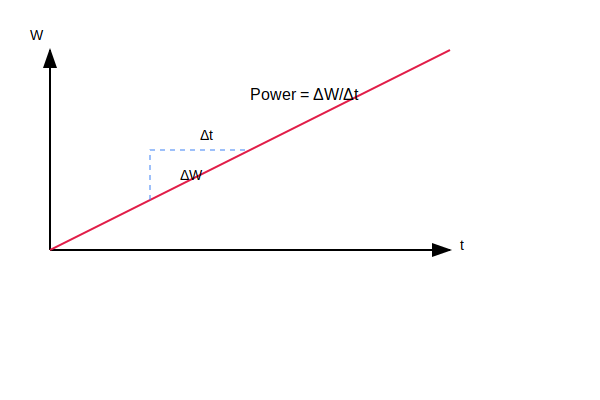
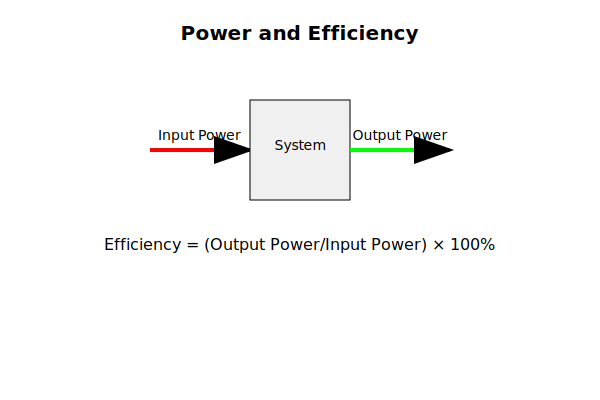

### INTRODUCTION
Power is a fundamental concept in physics that describes the rate at which work is done or energy is transferred. It is a measure of how quickly energy is used or transformed in physical systems. Understanding power is essential for analyzing the efficiency of machines, engines, and other systems that involve energy transfer.

## Definition of Power

Power is defined as the rate of doing work or transferring energy. Mathematically, it is expressed as:

$$
P = \frac{W}{t}
$$

where:
- $P$ = power (in Watts, W)
- $W$ = work done (in Joules, J)
- $t$ = time taken (in seconds, s)

## Units of Power

The SI unit of power is the **Watt (W)**, where:

$$
1 \text{ W} = 1 \text{ J/s}
$$

Other common units of power include:

- **Kilowatt (kW)**: $1 \text{ kW} = 1000 \text{ W}$
- **Horsepower (hp)**: $1 \text{ hp} \approx 746 \text{ W}$

---

## Types of Power

### Average Power

Average power represents the rate of work done or energy transferred over a specific time interval. It is particularly useful when analyzing the overall performance of machines and systems over extended periods.

When we divide the total work done by the total time taken, we get the average power:

$$
P_{\text{avg}} = \frac{W}{t}
$$

For example, if a motor does 1000 Joules of work in 5 seconds, its average power would be:

$$
P_{\text{avg}} = \frac{1000 \text{ J}}{5 \text{ s}} = 200 \text{ W}
$$

### Instantaneous Power

While average power gives us the overall rate of energy transfer, instantaneous power tells us the exact rate at any specific moment. This is crucial when analyzing systems with varying power output, such as accelerating vehicles or fluctuating electrical systems.

For a force causing motion, instantaneous power can be calculated using the force and velocity:

$$
P = F \cdot v
$$

where:
- $F$ = force applied (in Newtons, N)
- $v$ = velocity of the object (in m/s)

This formula shows that power depends on both how much force is applied and how fast the object is moving. For instance:
- A car climbing a hill slowly uses less power than the same car climbing quickly
- A weightlifter holding a heavy weight stationary uses no power (since velocity is zero)
- An electric motor running at high speed but with little load may use the same power as one running slowly with a heavy load

The relationship $P = F \cdot v$ is equivalent to $P = \frac{W}{t}$ because work is force times distance ($W = F \cdot d$), and velocity is distance over time ($v = \frac{d}{t}$).

---

## Real-World Examples of Power

1. **Light Bulb**: A 60-watt light bulb uses 60 joules of energy per second.
2. **Car Engine**: A car engine might produce 100,000 watts (100 kW) of power.
3. **Human Power**: A person might generate about 100 watts of power while cycling.
4. **Wind Turbine**: A wind turbine converts wind energy into electrical energy, with power outputs ranging from kilowatts to megawatts.
5. **Hydropower Plant**: A hydropower plant generates electricity by converting the gravitational potential energy of water into kinetic energy and then into electrical energy.

---

## Advanced Concepts in Power

### 1. **Power and Efficiency**

Efficiency measures how effectively energy is converted into useful work. It is defined as:
$$
\text{Efficiency} = \frac{\text{Useful Work Output}}{\text{Energy Input}} \times 100\%
$$
Power is related to efficiency because it measures the rate at which energy is used or transferred.

### 2. Power in Rotational Systems

In rotating mechanical systems, power measures how quickly rotational work is performed. The relationship between power, torque, and rotation speed is expressed as $P = τ⋅ω$. Here, torque ($τ$), measured in Newton-meters, represents the rotational force, while angular velocity ($ω$), measured in radians per second, indicates how fast the system rotates. This relationship mirrors linear power, showing that rotational power increases with either stronger torque or faster rotation.

### 3. Power in Electrical Systems

In electrical circuits, power quantifies the rate of electrical energy transfer. The equation $P = V⋅I$ describes this relationship, where voltage ($V$) in volts represents the electrical potential difference driving current flow, and current ($I$) in amperes measures the rate of charge flow. This fundamental relationship determines power consumption in all electrical devices, from simple resistors to complex electronic systems.

---

## Common Misconceptions About Power

1. **Power is the Same as Energy**: Power measures how quickly energy is used or transferred, while energy is the capacity to do work.
2. **Power is Always Constant**: Power can vary depending on the rate at which work is done or energy is transferred.
3. **High Power Means High Efficiency**: Power measures the rate of energy transfer, not how efficiently energy is used.

---

## Equations of Power

1. **Average Power**:
   $$
   P = \frac{W}{t}
   $$

2. **Instantaneous Power**:
   $$
   P = F \cdot v
   $$

3. **Power in Rotational Systems**:
   $$
   P = \tau \cdot \omega
   $$

4. **Power in Electrical Systems**:
   $$
   P = V \cdot I
   $$

---

## Practice Problems

### Problem 1: Basic Power Calculations

**Problem 1.1**: A motor does 2500 Joules of work in 5 seconds. Calculate its average power output.

**Solution**:
Using $P_{\text{avg}} = \frac{W}{t}$
- Work done ($W$) = 2500 J
- Time taken ($t$) = 5 s
- $P_{\text{avg}} = \frac{2500 \text{ J}}{5 \text{ s}} = 500 \text{ W}$

**Problem 1.2**: An elevator motor performs 24,000 Joules of work in 30 seconds. What is its power rating in kilowatts?

**Solution**:
Using $P_{\text{avg}} = \frac{W}{t}$
- Work done ($W$) = 24,000 J
- Time taken ($t$) = 30 s
- $P_{\text{avg}} = \frac{24,000 \text{ J}}{30 \text{ s}} = 800 \text{ W} = 0.8 \text{ kW}$

### Problem 2: Power and Force

**Problem 2.1**: A car exerts a force of 2000 N while moving at a constant velocity of 15 m/s. Calculate the instantaneous power output.

**Solution**:
Using $P = F \cdot v$
- Force ($F$) = 2000 N
- Velocity ($v$) = 15 m/s
- $P = 2000 \text{ N} \times 15 \text{ m/s} = 30,000 \text{ W} = 30 \text{ kW}$

**Problem 2.2**: A cyclist generates a forward force of 200 N while riding at 8 m/s. What is the power output in watts?

**Solution**:
Using $P = F \cdot v$
- Force ($F$) = 200 N
- Velocity ($v$) = 8 m/s
- $P = 200 \text{ N} \times 8 \text{ m/s} = 1600 \text{ W}$

### Problem 3: Power and Energy Transfer

**Problem 3.1**: An electric heater transfers 15,000 Joules of heat energy in 2 minutes. Calculate its power rating in watts.

**Solution**:
Using $P_{\text{avg}} = \frac{W}{t}$
- Energy transferred ($W$) = 15,000 J
- Time ($t$) = 2 min = 120 s
- $P_{\text{avg}} = \frac{15,000 \text{ J}}{120 \text{ s}} = 125 \text{ W}$

**Problem 3.2**: A solar panel delivers 5 kW of power. How much energy does it transfer in 30 minutes?

**Solution**:
Using $W = P \times t$
- Power ($P$) = 5 kW = 5000 W
- Time ($t$) = 30 min = 1800 s
- $W = 5000 \text{ W} \times 1800 \text{ s} = 9,000,000 \text{ J} = 9 \text{ MJ}$

### Problem 4: Power in Lifting

**Problem 4.1**: A crane lifts a 500 kg load to a height of 20 meters in 25 seconds. Calculate the average power output. (g = 9.81 m/s²)

**Solution**:
1. Calculate work done:
   - Force = $mg = 500 \text{ kg} \times 9.81 \text{ m/s}^2 = 4905 \text{ N}$
   - Work = $F \times d = 4905 \text{ N} \times 20 \text{ m} = 98,100 \text{ J}$
2. Calculate power:
   - $P_{\text{avg}} = \frac{98,100 \text{ J}}{25 \text{ s}} = 3924 \text{ W} \approx 3.92 \text{ kW}$

**Problem 4.2**: An elevator lifts a 300 kg load at a constant velocity of 2 m/s. What power is required? (g = 9.81 m/s²)

**Solution**:
Using $P = F \cdot v$
- Force = $mg = 300 \text{ kg} \times 9.81 \text{ m/s}^2 = 2943 \text{ N}$
- $P = 2943 \text{ N} \times 2 \text{ m/s} = 5886 \text{ W} \approx 5.89 \text{ kW}$

### Problem 5: Power and Mechanical Systems

**Problem 5.1**: A motor rotates a wheel with a torque of 50 N⋅m at 300 rpm. Calculate the power output in watts.

**Solution**:
1. Convert rpm to rad/s:
   - $\omega = 300 \text{ rpm} \times \frac{2\pi \text{ rad}}{60 \text{ s}} = 31.42 \text{ rad/s}$
2. Calculate power:
   - $P = \tau \omega = 50 \text{ N⋅m} \times 31.42 \text{ rad/s} = 1571 \text{ W}$

**Problem 5.2**: A turbine generates 2.5 kW of power while rotating at 1200 rpm. What is the torque?

**Solution**:
1. Convert units:
   - Power = 2500 W
   - $\omega = 1200 \text{ rpm} \times \frac{2\pi \text{ rad}}{60 \text{ s}} = 125.66 \text{ rad/s}$
2. Calculate torque:
   - $\tau = \frac{P}{\omega} = \frac{2500 \text{ W}}{125.66 \text{ rad/s}} = 19.9 \text{ N⋅m}$

### Problem 6: Power Efficiency

**Problem 6.1**: A motor has an input power of 2000 W and an output power of 1600 W. Calculate its efficiency.

**Solution**:
Using $\text{Efficiency} = \frac{P_{\text{out}}}{P_{\text{in}}} \times 100\%$
- $\text{Efficiency} = \frac{1600 \text{ W}}{2000 \text{ W}} \times 100\% = 80\%$

**Problem 6.2**: An electric motor is 85% efficient and outputs 3.4 kW. What is its input power?

**Solution**:
Using $P_{\text{in}} = \frac{P_{\text{out}}}{\text{Efficiency}}$
- $P_{\text{in}} = \frac{3400 \text{ W}}{0.85} = 4000 \text{ W} = 4 \text{ kW}$

### Problem 7: Power in Fluid Systems

**Problem 7.1**: A pump raises water to a height of 15 meters at a rate of 200 liters per minute. Calculate the power required. (Density of water = 1000 kg/m³)

**Solution**:
1. Convert flow rate to m³/s:
   - $200 \text{ L/min} = \frac{0.2 \text{ m}^3}{60 \text{ s}} = 0.00333 \text{ m}^3/\text{s}$
2. Calculate power:
   - Force = $\rho V g h = 1000 \times 0.00333 \times 9.81 \times 15$
   - $P = 490.5 \text{ W}$

**Problem 7.2**: A hydraulic system delivers oil at 20 MPa with a flow rate of 2 L/s. What is the power output?

**Solution**:
Using $P = \text{pressure} \times \text{flow rate}$
- $P = 20 \times 10^6 \text{ Pa} \times 0.002 \text{ m}^3/\text{s} = 40,000 \text{ W} = 40 \text{ kW}$

### Problem 8: Power in Electrical Systems

**Problem 8.1**: An electric current of 5 A flows through a resistance of 20 Ω. Calculate the power dissipated.

**Solution**:
Using $P = I^2R$
- Current ($I$) = 5 A
- Resistance ($R$) = 20 Ω
- $P = 5^2 \times 20 = 500 \text{ W}$

**Problem 8.2**: A 120 V circuit dissipates 1440 W. What is the current flowing?

**Solution**:
Using $P = VI$
- $I = \frac{P}{V} = \frac{1440 \text{ W}}{120 \text{ V}} = 12 \text{ A}$

### Problem 9: Power in Acceleration

**Problem 9.1**: A 1200 kg car accelerates from 0 to 20 m/s in 8 seconds. Calculate the average power output.

**Solution**:
1. Calculate kinetic energy change:
   - $\Delta KE = \frac{1}{2}m(v_2^2 - v_1^2) = \frac{1}{2} \times 1200 \times (400 - 0) = 240,000 \text{ J}$
2. Calculate power:
   - $P_{\text{avg}} = \frac{240,000 \text{ J}}{8 \text{ s}} = 30,000 \text{ W} = 30 \text{ kW}$

**Problem 9.2**: A 75 kg sprinter accelerates from rest to 10 m/s in 2 seconds. What is the average power output?

**Solution**:
1. Calculate kinetic energy change:
   - $\Delta KE = \frac{1}{2}m(v_2^2 - v_1^2) = \frac{1}{2} \times 75 \times (100 - 0) = 3750 \text{ J}$
2. Calculate power:
   - $P_{\text{avg}} = \frac{3750 \text{ J}}{2 \text{ s}} = 1875 \text{ W}$

### Problem 10: Power in Climbing

**Problem 10.1**: A 70 kg person climbs stairs at a rate of 1 vertical meter per second. Calculate the power output. (g = 9.81 m/s²)

**Solution**:
Using $P = F \cdot v$
- Force = $mg = 70 \text{ kg} \times 9.81 \text{ m/s}^2 = 686.7 \text{ N}$
- $P = 686.7 \text{ N} \times 1 \text{ m/s} = 686.7 \text{ W}$

**Problem 10.2**: A mountain climber of mass 80 kg ascends 300 meters in 1 hour. What is their average power output? (g = 9.81 m/s²)

**Solution**:
1. Calculate work done:
   - Force = $mg = 80 \text{ kg} \times 9.81 \text{ m/s}^2 = 784.8 \text{ N}$
   - Work = $F \times d = 784.8 \text{ N} \times 300 \text{ m} = 235,440 \text{ J}$
2. Calculate power:
   - Time = 1 hour = 3600 s
   - $P_{\text{avg}} = \frac{235,440 \text{ J}}{3600 \text{ s}} = 65.4 \text{ W}$

### Problem 11: Power in Rotational Motion

**Problem 11.1**: A flywheel with moment of inertia 2 kg⋅m² accelerates from rest to 300 rad/s in 10 seconds. Calculate the average power input.

**Solution**:
1. Calculate rotational kinetic energy change:
   - $\Delta KE_{\text{rot}} = \frac{1}{2}I\omega^2 = \frac{1}{2} \times 2 \times 300^2 = 90,000 \text{ J}$
2. Calculate power:
   - $P_{\text{avg}} = \frac{90,000 \text{ J}}{10 \text{ s}} = 9000 \text{ W} = 9 \text{ kW}$

**Problem 11.2**: A motor delivers 5 kW of power to a shaft rotating at 1800 rpm. Calculate the torque applied.

**Solution**:
1. Convert rpm to rad/s:
   - $\omega = 1800 \text{ rpm} \times \frac{2\pi}{60} = 188.5 \text{ rad/s}$
2. Calculate torque:
   - $\tau = \frac{P}{\omega} = \frac{5000 \text{ W}}{188.5 \text{ rad/s}} = 26.5 \text{ N⋅m}$

### Problem 12: Power in Machines

**Problem 12.1**: A conveyor belt moves packages at 2 m/s against a resistance force of 400 N. What power is required to maintain this motion?

**Solution**:
Using $P = F \cdot v$
- Force = 400 N
- Velocity = 2 m/s
- $P = 400 \text{ N} \times 2 \text{ m/s} = 800 \text{ W}$

**Problem 12.2**: An industrial fan requires 2.5 kW to maintain operation. If it runs for 8 hours, how much electrical energy does it consume in kilowatt-hours?

**Solution**:
Using $E = P \times t$
- Power = 2.5 kW
- Time = 8 hours
- $E = 2.5 \text{ kW} \times 8 \text{ h} = 20 \text{ kWh}$

### Problem 1: Average Power
A machine does 1200 J of work in 30 seconds. What is its power output?

**Solution**:
$$
P = \frac{W}{t} = \frac{1200 \text{ J}}{30 \text{ s}} = 40 \text{ W}
$$

### Problem 2: Instantaneous Power
A car engine produces a constant force of 2000 N to move the car at a constant velocity of 20 m/s. What is the power output of the engine?

**Solution**:
Power is given by:
$$
P = F \cdot v = 2000 \text{ N} \times 20 \text{ m/s} = 40,000 \text{ W} = 40 \text{ kW}
$$

### Problem 3: Power and Work
A motor does 5000 J of work in 10 seconds. What is its power output?

**Solution**:
Power is given by:
$$
P = \frac{W}{t} = \frac{5000 \text{ J}}{10 \text{ s}} = 500 \text{ W}
$$

### Problem 4: Power and Energy
A light bulb uses 600 J of energy in 10 seconds. What is its power consumption?

**Solution**:
Power is given by:
$$
P = \frac{W}{t} = \frac{600 \text{ J}}{10 \text{ s}} = 60 \text{ W}
$$

### Problem 5: Power and Force
A person pushes a box with a force of 50 N at a constant velocity of 2 m/s. What is the power exerted by the person?

**Solution**:
Power is given by:
$$
P = F \cdot v = 50 \text{ N} \times 2 \text{ m/s} = 100 \text{ W}
$$

### Problem 6: Power and Time
A machine has a power output of 500 W. How much work does it do in 20 seconds?

**Solution**:
Work done is given by:
$$
W = P \cdot t = 500 \text{ W} \times 20 \text{ s} = 10,000 \text{ J}
$$

### Problem 7: Power and Efficiency
A machine takes in 1000 J of energy and performs 800 J of useful work in 10 seconds. What is its power output and efficiency?

**Solution**:
Power output:
$$
P = \frac{W}{t} = \frac{800 \text{ J}}{10 \text{ s}} = 80 \text{ W}
$$
Efficiency:
$$
\text{Efficiency} = \frac{\text{Useful Work Output}}{\text{Energy Input}} \times 100\% = \frac{800 \text{ J}}{1000 \text{ J}} \times 100\% = 80\%
$$

### Problem 8: Power and Velocity
A cyclist generates 200 W of power while riding at a constant velocity of 10 m/s. What is the force exerted by the cyclist?

**Solution**:
Power is given by:
$$
P = F \cdot v
$$
Rearranging for force:
$$
F = \frac{P}{v} = \frac{200 \text{ W}}{10 \text{ m/s}} = 20 \text{ N}
$$

### Problem 9: Power and Acceleration
A car of mass 1000 kg accelerates from rest to 20 m/s in 10 seconds. What is the average power output of the car's engine?

**Solution**:
First, calculate the work done using the work-energy theorem:
$$
W = \Delta KE = \frac{1}{2} m v_f^2 - \frac{1}{2} m v_i^2
$$
$$
W = \frac{1}{2} \times 1000 \text{ kg} \times (20 \text{ m/s})^2 - 0 = 200,000 \text{ J}
$$
Average power:
$$
P = \frac{W}{t} = \frac{200,000 \text{ J}}{10 \text{ s}} = 20,000 \text{ W} = 20 \text{ kW}
$$

### Problem 10: Power and Height
A pump lifts 100 kg of water to a height of 10 meters in 20 seconds. What is the power output of the pump? (Assume \( g = 9.81 \text{ m/s}^2 \))

**Solution**:
Work done:
$$
W = m g h = 100 \text{ kg} \times 9.81 \text{ m/s}^2 \times 10 \text{ m} = 9810 \text{ J}
$$
Power output:
$$
P = \frac{W}{t} = \frac{9810 \text{ J}}{20 \text{ s}} = 490.5 \text{ W}
$$

### Problem 11: Power in Rotational Systems
A motor applies a torque of 50 N⋅m to a wheel rotating at 10 rad/s. What is the power output of the motor?

**Solution**:
Power in rotational systems is given by:
$$
P = \tau \cdot \omega = 50 \text{ N}\cdot\text{m} \times 10 \text{ rad/s} = 500 \text{ W}
$$

### Problem 12: Power in Electrical Systems
A circuit has a voltage of 120 V and a current of 5 A. What is the power consumed by the circuit?

**Solution**:
Power is given by:
$$
P = V \cdot I = 120 \text{ V} \times 5 \text{ A} = 600 \text{ W}
$$

---
